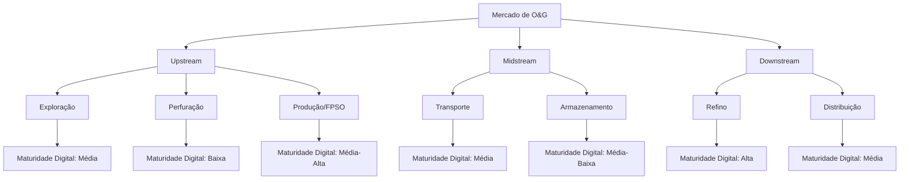
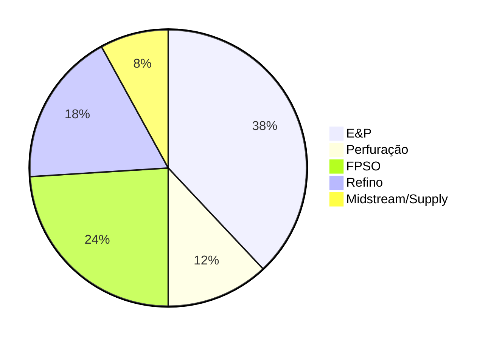
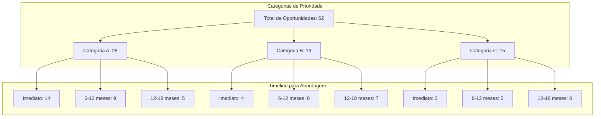
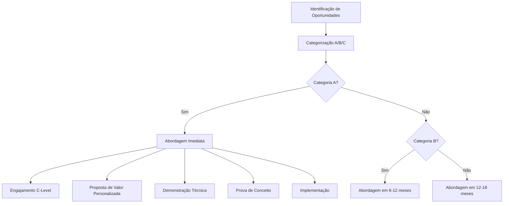
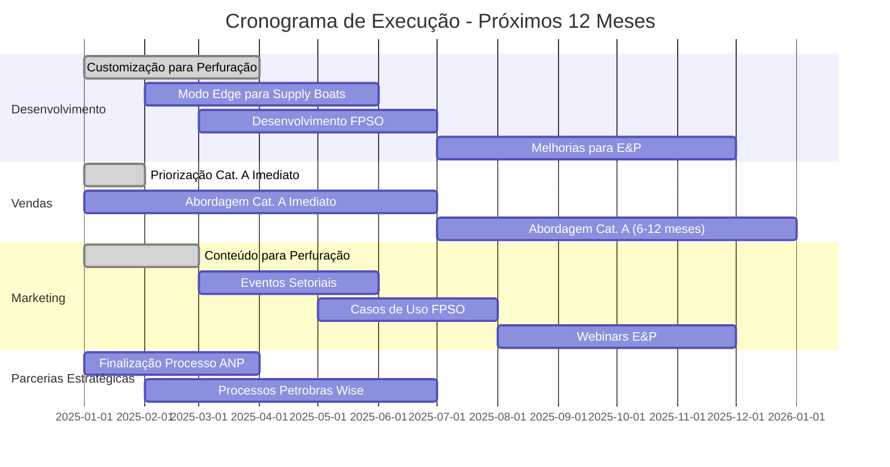

# Análise Estratégica: Mercado de Óleo e Gás para Wonder DataLabs

## 1. Sumário Executivo

A Wonder DataLabs (WDL) possui uma oportunidade significativa no setor de Óleo e Gás (O&G), especialmente aproveitando a experiência profunda da equipe fundadora neste mercado. Nossa análise identifica um caminho claro para crescimento exponencial através de vendas diretas, com foco em áreas onde nossa vantagem competitiva é mais pronunciada.

Este relatório apresenta uma análise abrangente do mercado de O&G, priorização de oportunidades e um plano de ação concreto para os próximos 12 meses. A estratégia proposta equilibra ambição com realismo, considerando nosso ciclo de vendas típico de 6 meses e taxas de conversão realistas para software enterprise B2B.

**Avanços Estratégicos Recentes:**
- O Sentinel está na fase final de seleção pela ANP como plataforma de referência para o setor
- O Wise está sendo avaliado pela Petrobras como plataforma oficial de compartilhamento de conhecimento
- Novo modelo de precificação para embarcações de apoio abre oportunidades significativas com efeito de rede

## 2. Panorama do Mercado de O&G

### 2.1 Cenário Global e Brasileiro

O setor de O&G no Brasil representa aproximadamente 13% do PIB nacional, com investimentos projetados de R$ 102 bilhões para os próximos cinco anos[¹]. A digitalização deste setor está em diferentes estágios de maturidade, com oportunidades significativas em todos os segmentos.

### 2.2 Desafios do Setor

Os principais desafios enfrentados pelo setor de O&G que a WDL pode resolver incluem:

1. **Perda de conhecimento crítico:** Aposentadoria de profissionais experientes e alta rotatividade
2. **Ineficiências operacionais:** Processos manuais e sistemas desconectados
3. **Decisões reativas vs. preditivas:** Falta de monitoramento em tempo real e análise preditiva
4. **Complexidade de integração:** Sistemas legados e dificuldade de implementação

### 2.3 Gastos com Tecnologia por Segmento

Os investimentos em tecnologia variam significativamente entre os segmentos do setor de O&G:

## 3. Análise de Oportunidades

### 3.1 Metodologia de Pontuação

Nossa análise classificou cada oportunidade potencial com base em múltiplos fatores:
- Tamanho potencial do contrato
- Maturidade digital
- Acessibilidade das partes interessadas
- Compatibilidade com nossas soluções
- Timing para tomada de decisão

O resultado é uma pontuação de oportunidade de 0-100 e uma classificação em categorias A, B e C por prioridade.

### 3.2 Distribuição de Oportunidades

### 3.3 Análise por Segmento

A tabela abaixo representa o número de oportunidades identificadas por segmento e categoria:

| Segmento | Cat. A | Cat. B | Cat. C | Total | Valor Potencial (R$ M) |
|----------|--------|--------|--------|-------|------------------------|
| Perfuração | 8 | 6 | 3 | 17 | 10,5 |
| FPSO | 7 | 5 | 4 | 16 | 22,4 |
| E&P | 9 | 3 | 5 | 17 | 15,8 |
| Refino | 4 | 5 | 3 | 12 | 18,2 |
| Supply Boats | 3 | 2 | 2 | 7 | 8,5 |
| **Total** | **31** | **21** | **17** | **69** | **75,4** |

**Nota:** Os valores potenciais representam uma estimativa extremamente conservadora, considerando apenas implementações iniciais limitadas (ex: apenas 1 FPSO de um universo de 7 para uma única empresa).

## 4. Análise por Segmento

### 4.1 Perfuração (Força da WDL)

O segmento de perfuração representa nossa maior vantagem competitiva devido à extensa experiência da equipe fundadora na Valaris. Identificamos 17 oportunidades neste segmento, com 8 classificadas como categoria A.

**Principais insights:**
- Menor maturidade digital = menos concorrência e maior necessidade
- Conhecimento específico da equipe fundadora é altamente valorizado
- Ciclos de decisão mais longos, mas maior fidelidade após implementação
- Valor de contrato médio: R$ 620k
- **Oportunidade Estratégica:** Wise está sendo avaliado pela Petrobras como plataforma padrão de compartilhamento de conhecimento, com potencial de se tornar obrigatório para contratados de perfuração

**Desafios específicos:**
- Menor orçamento para tecnologia comparado a outros segmentos
- Maior resistência à mudança cultural
- Requisitos de segurança mais rigorosos

### 4.2 FPSO

O segmento de FPSO representa a maior oportunidade em termos de valor de contrato, com 16 oportunidades identificadas e valor potencial de R$ 22,4 milhões.

**Principais insights:**
- Maturidade digital média-alta = casos de uso bem definidos
- Desafios críticos em monitoramento de equipamentos e otimização
- Alto potencial para expansão dentro da mesma empresa
- Valor de contrato médio: R$ 1,4M
- **Avanço Institucional:** Sentinel tornou-se a plataforma de escolha para FPSOs no Brasil e está na fase final de seleção pela ANP

**Desafios específicos:**
- Maior concorrência de soluções específicas
- Processos de compra mais complexos
- Necessidade de integração com sistemas existentes

### 4.3 Embarcações de Apoio (Supply Boats)

O segmento de embarcações de apoio representa uma oportunidade de crescimento com efeito de rede significativo:

**Principais insights:**
- Nova estratégia de precificação por embarcação (especialmente para Wise)
- Capacidade de operação em edge computing cria forte diferencial
- Orçamentos descentralizados facilitam decisões de compra
- Empresas com grandes frotas (como CBO com 44 embarcações) podem gerar contas maiores que empresas de E&P
- Valor médio por embarcação: R$ 45-60k/ano

**Estratégia específica:**
- Abordagem por frota em vez de projetos individuais
- Implementação faseada para demonstrar valor rapidamente
- Foco em eficiência operacional e redução de combustível como ROI principal

### 4.4 E&P e Refino

Os segmentos de E&P e refino apresentam alto valor potencial e diferentes níveis de maturidade digital:

**E&P:**
- 9 oportunidades categoria A
- Forte necessidade de monitoramento em tempo real
- Valor médio de contrato: R$ 930k

**Refino:**
- Maior maturidade digital do setor
- Orçamentos mais significativos para transformação digital
- 4 oportunidades categoria A com valor médio de R$ 1,5M
- **Avanço Institucional:** Sentinel tornou-se a plataforma de escolha para refinarias no Brasil e está na fase final de seleção pela ANP

## 5. Estratégia de Go-to-Market

### 5.1 Abordagem de Vendas Direta

Com base na análise e no feedback do VC, focaremos em vendas diretas em vez de parcerias com consultorias:

### 5.2 Ciclo de Vendas e Conversão

Considerando nosso ciclo de vendas típico de 6 meses e métricas de conversão realistas para soluções enterprise:

| Estágio | Número de Oportunidades | Taxa de Conversão | Próximo Estágio |
|---------|-------------------------|-------------------|-----------------|
| Oportunidades Identificadas (Cat. A) | 28 | 70% | 20 |
| Reunião Inicial | 20 | 80% | 16 |
| Demonstração Técnica | 16 | 60% | 10 |
| Prova de Conceito | 10 | 100% | 10 |
| Proposta/Negociação | 10 | 80% | 8 |
| Fechamento | 8 | 100% | 8 |

## 6. Plano de Ação para 12 Meses

### 6.1 Objetivos Principais

1. **Objetivo de Receita:** R$ 5,5-10,5 milhões em novos contratos de O&G
2. **Novos Clientes:** 6-10 novos clientes enterprise no setor de O&G
3. **Conversão de Pipeline:** 40-50% das oportunidades categoria A em clientes pagantes
4. **Avanços Institucionais:** Finalizar processo com ANP e Petrobras para formalização como plataformas recomendadas

### 6.2 Cronograma de Atividades

## 7. Conclusão e Próximos Passos

A Wonder DataLabs possui uma oportunidade significativa no setor de O&G, especialmente nas áreas onde temos vantagem competitiva clara. A estratégia de vendas diretas, com foco nas oportunidades de categoria A, proporcionará o crescimento exponencial desejado.

Os avanços institucionais com a ANP e Petrobras posicionam a empresa para uma expansão potencialmente muito maior que as projeções conservadoras apresentadas neste relatório. Adicionalmente, o novo modelo de negócios para embarcações de apoio cria uma oportunidade de efeito de rede significativo.

**Próximas ações imediatas:**

1. Refinamento da estratégia de abordagem para oportunidades categoria A com timeline imediato
2. Desenvolvimento de materiais de vendas específicos para o segmento de perfuração
3. Estruturação da equipe de vendas diretas com especialização em O&G
4. Implementação de sistema de tracking para monitoramento do pipeline
5. Aceleração dos processos com ANP e Petrobras para formalização dos acordos institucionais

Essa abordagem focada nos permitirá capitalizar nossa vantagem competitiva no setor de O&G e alcançar um crescimento significativo nos próximos 12 meses, construindo a base para expansão futura em outros segmentos.

---

**Notas e Fontes:**

[¹] Fonte: IBP (Instituto Brasileiro de Petróleo e Gás) - Relatório Anual 2023

[²] Taxas de conversão baseadas em benchmarks do setor para software B2B enterprise, ajustadas para o ciclo de vendas típico de soluções industriais. Fonte: Forrester Research "B2B Sales Benchmark Report 2023"

[³] Análise de mercado de O&G baseada em dados da ANP, IBP e relatórios setoriais da McKinsey & Company "Digital Transformation in Oil and Gas" (2023)

[⁴] Tamanho de mercado e potencial de crescimento baseados em relatório da Statista "Digital Transformation in Oil & Gas Market Size" (2023)

[⁵] Dados sobre maturidade digital por segmento baseados em pesquisa da Accenture "Digital Adoption in Energy Sector" (2022)

*Este relatório foi preparado pela Wonder DataLabs com base em análise de dados proprietária e pesquisa de mercado. Os números apresentados representam nossas melhores estimativas com base em informações disponíveis e histórico de vendas.*
