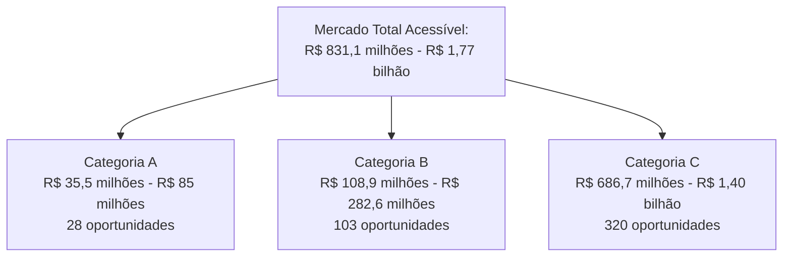
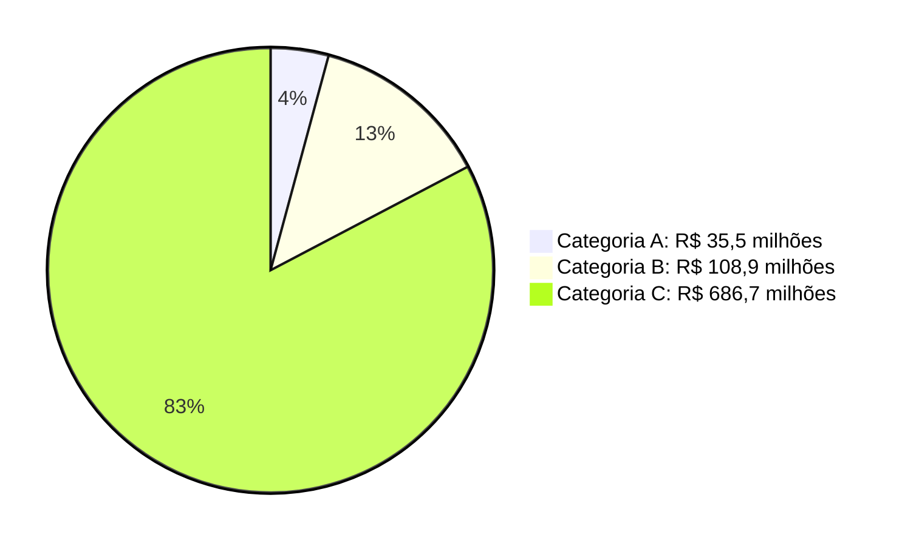
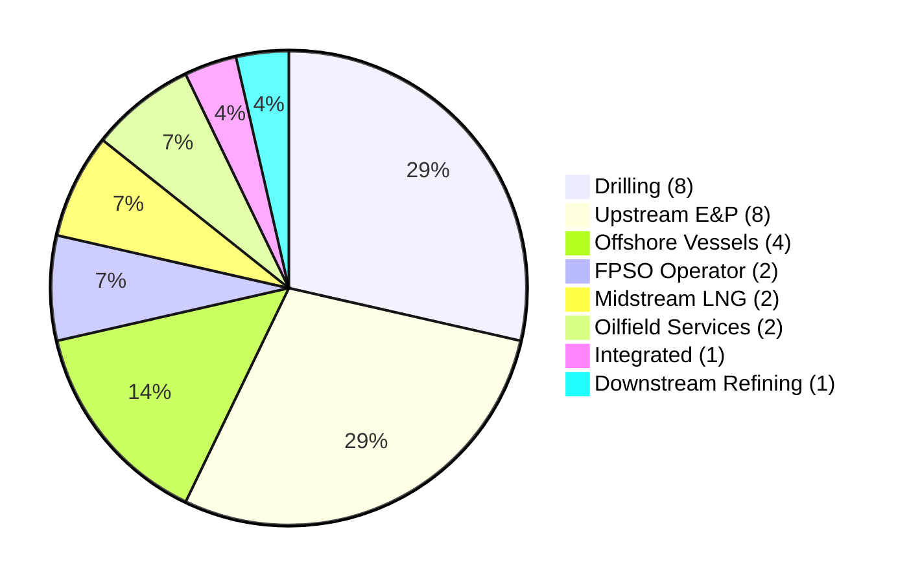
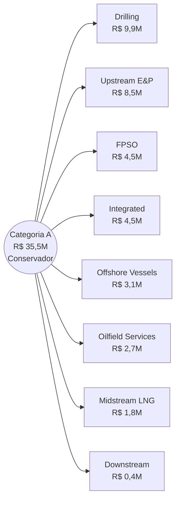
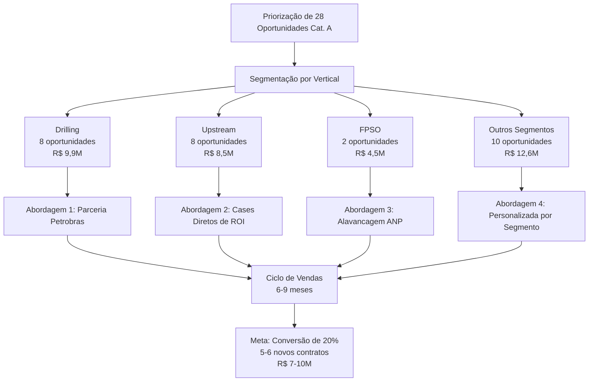
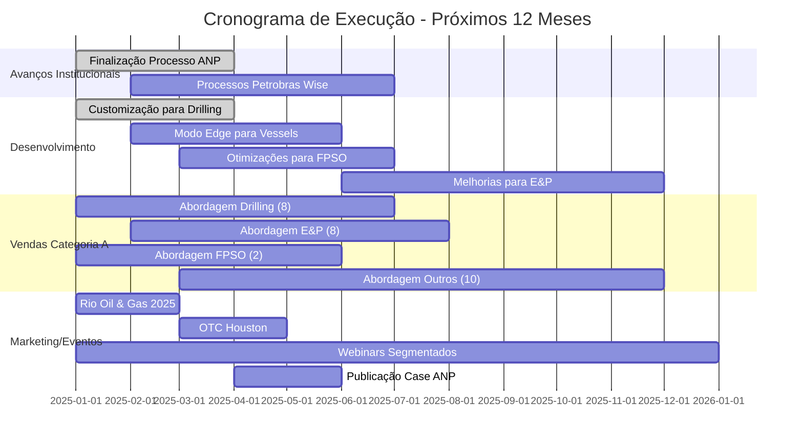

# Análise Estratégica: Mercado de Óleo e Gás para Wonder DataLabs

## 1. Sumário Executivo

A Wonder DataLabs (WDL) identificou um mercado potencial massivo no setor de Óleo e Gás (O&G), com 451 oportunidades mapeadas representando um potencial de receita conservador de R$ 831,1 milhões (podendo chegar a R$ 1,77 bilhão em cenário otimista).

Nossa análise focou em identificar as oportunidades de maior valor e probabilidade de conversão, resultando em 28 oportunidades classificadas como categoria A, com potencial conservador de R$ 35,5 milhões.

**Avanços Estratégicos Recentes:**
- O Sentinel está na fase final de seleção pela ANP como plataforma de referência para o setor
- O Wise está sendo avaliado pela Petrobras como plataforma oficial de compartilhamento de conhecimento
- Novo modelo de precificação para embarcações de apoio abre oportunidades significativas com efeito de rede

Esta estratégia prioriza crescimento exponencial através de vendas diretas focadas nas oportunidades de maior potencial, estabelecendo nossa presença nos segmentos mais lucrativos do mercado de O&G.

## 2. Panorama do Mercado de O&G e Potencial Total

### 2.1 Mercado Total Acessível (TAM - ARR)

Nossa análise detalhada identifica um mercado endereçável massivo para as soluções da Wonder DataLabs:

### 2.2 Investimentos em Tecnologia no Setor

O setor de O&G no Brasil representa aproximadamente 13% do PIB nacional, com investimentos projetados de R$ 102 bilhões para os próximos cinco anos[¹]. A Petrobras sozinha anunciou plano de investimentos de US$ 78 bilhões para 2024-2028, com aproximadamente US$ 7,5 bilhões destinados a projetos de digitalização e novas tecnologias[³].

## 3. Análise das Oportunidades Categoria A

### 3.1 Distribuição por Segmento

### 3.2 Potencial de Receita Recorrente Anual por Segmento (Categoria A)

| Segmento | # Oportunidades | Potencial Conservador (R$) | Potencial Otimista (R$) |
|----------|-----------------|----------------------------|-------------------------|
| Drilling | 8 | 9.900.000 | 24.300.000 |
| Upstream (E&P) | 8 | 8.550.000 | 20.250.000 |
| FPSO Operator | 2 | 4.500.000 | 9.000.000 |
| Integrated | 1 | 4.500.000 | 9.000.000 |
| Offshore Vessels | 4 | 3.150.000 | 9.450.000 |
| Oilfield Services | 2 | 2.700.000 | 6.300.000 |
| Midstream (LNG) | 2 | 1.800.000 | 5.400.000 |
| Downstream (Refining) | 1 | 450.000 | 1.350.000 |
| **Total** | **28** | **35.550.000** | **85.050.000** |

## 4. Análise Detalhada por Segmento Prioritário

### 4.1 Drilling (Força Principal da WDL)
**Total de Oportunidades:** 29 (8 categoria A, 6 categoria B, 15 categoria C)
**Potencial de Receita Recorrente Anual (Categoria A):**
- Conservador: R$ 9,9 milhões
- Otimista: R$ 24,3 milhões

**Potencial Total do Segmento:**
- Conservador: R$ 41,85 milhões
- Otimista: R$ 94,05 milhões

**Proposta de Valor Principal:**
- Wonder Wise: Plataforma de transferência de conhecimento para equipes de perfuração
- Wonder Sentinel: Prevenção de falhas em equipamentos críticos de perfuração

**Avanço Estratégico:** O Wise está sendo avaliado pela Petrobras como plataforma oficial de compartilhamento de conhecimento, com potencial de se tornar obrigatório para contratados de perfuração.

### 4.2 Upstream (E&P)
**Total de Oportunidades:** 122 (8 categoria A, 39 categoria B, 75 categoria C)
**Potencial de Receita Recorrente Anual (Categoria A):**
- Conservador: R$ 8,55 milhões
- Otimista: R$ 20,25 milhões

**Potencial Total do Segmento:**
- Conservador: R$ 189,45 milhões
- Otimista: R$ 421,65 milhões

**Proposta de Valor Principal:**
- Wonder Sentinel: Monitoramento em tempo real de equipamentos críticos com redução de 40% em tempo de inatividade
- Wonder Wise: Preservação de conhecimento crítico de operações

**Avanço Estratégico:** Sistema Wonder Sentinel sendo avaliado pela ANP como plataforma de referência.

### 4.3 FPSO Operator
**Total de Oportunidades:** 10 (2 categoria A, 2 categoria B, 6 categoria C)
**Potencial de Receita Recorrente Anual (Categoria A):**
- Conservador: R$ 4,5 milhões
- Otimista: R$ 9 milhões

**Potencial Total do Segmento:**
- Conservador: R$ 19,8 milhões
- Otimista: R$ 40,5 milhões

**Proposta de Valor Principal:**
- Wonder Sentinel: Monitoramento em tempo real e otimização de processos críticos
- Wonder Wise: Gestão de conhecimento para operações complexas

**Avanço Estratégico:** Sentinel tornou-se a plataforma de escolha para FPSOs no Brasil e está na fase final de seleção pela ANP.

### 4.4 Offshore Vessels
**Total de Oportunidades:** 20 (4 categoria A, 13 categoria B, 3 categoria C)
**Potencial de Receita Recorrente Anual (Categoria A):**
- Conservador: R$ 3,15 milhões
- Otimista: R$ 9,45 milhões

**Potencial Total do Segmento:**
- Conservador: R$ 19,8 milhões
- Otimista: R$ 54 milhões

**Proposta de Valor Principal:**
- Modelo de negócio por embarcação
- Capacidade de operação em edge
- Redução de consumo de combustível e otimização de manutenção

**Vantagem Estratégica:** Nossa capacidade de operação em edge computing e o modelo de precificação por embarcação criam um forte diferencial, permitindo que cada contrato gere receitas significativas pelo efeito de frota.

## 5. Estratégia de Go-to-Market e Projeções

### 5.1 Abordagem de Vendas Direta

Nossa estratégia de vendas se concentrará em converter as 28 oportunidades de categoria A, com abordagem personalizada por segmento:

### 5.2 Ciclo de Vendas e Projeção de Conversão

| Estágio | Número de Oportunidades | Taxa de Conversão | Próximo Estágio |
|---------|-------------------------|-------------------|-----------------|
| Oportunidades Identificadas (Cat. A) | 28 | 50% | 14 |
| Reunião Inicial | 14 | 70% | 10 |
| Demonstração Técnica | 10 | 60% | 6 |
| Prova de Conceito | 6 | 85% | 5 |
| Proposta/Negociação | 5 | 90% | 4-5 |
| Fechamento | 4-5 | 100% | 4-5 |

**Projeção de Receita (Próximos 12 meses):**
- Valor médio por contrato: R$ 1,5-2M (baseado no potencial médio das oportunidades cat. A)
- Total com 4-5 contratos: R$ 7-10M
- % do mercado TAM: Apenas 0,8-1,2% do potencial conservador total

### 5.3 Projeção Trimestral

| Trimestre | Pipeline Ativo | Novos Contratos | Receita Incremental (R$) |
|-----------|----------------|-----------------|--------------------------|
| Q1 2025 | 14 | 0-1 | 0-2M |
| Q2 2025 | 10 | 1-2 | 1,5-4M |
| Q3 2025 | 7 | 1-2 | 1,5-4M |
| Q4 2025 | 5 | 2 | 4M |
| **Total 12 meses** | **-** | **4-5** | **7-10M** |

## 6. Plano de Ação para 12 Meses

### 6.1 Metas de Receita por Segmento

| Segmento | Meta 12 Meses (R$) | % do Potencial Cat. A | # Contratos Projetados |
|----------|---------------------|----------------------|------------------------|
| Drilling | 2,5-3,0M | 25-30% | 1-2 |
| Upstream (E&P) | 2,0-2,5M | 23-29% | 1 |
| FPSO | 1,5-2,0M | 33-44% | 1 |
| Outros Segmentos | 1,0-2,5M | 8-20% | 1-2 |
| **Total** | **7-10M** | **20-28%** | **4-5** |

### 6.2 Cronograma de Execução

## 7. Conclusão e Potencial de Expansão

Nossa análise detalhada revela que a Wonder DataLabs está posicionada para capturar uma fatia significativa de um mercado massivo de R$ 831,1 milhões (conservador) a R$ 1,77 bilhão (otimista), valores estes recorrentes e anuais. A estratégia de focar inicialmente nas 28 oportunidades categoria A permitirá alcançar receita incremental de R$ 7-10 milhões recorrentes nos próximos 12 meses, representando apenas 0,8-1,2% do mercado potencial total.

**Fatores de Aceleração de Crescimento:**

1. **Efeito ANP/Petrobras:** A aprovação formal como plataforma recomendada pode transformar drasticamente nossa taxa de conversão, potencialmente multiplicando por 2-3x nossa projeção de receita.

2. **Expansão para Categoria B:** Após estabelecer presença forte com clientes categoria A, a expansão para as 103 oportunidades categoria B (R$ 108,9 milhões potenciais) representa o próximo horizonte de crescimento.

3. **Efeito de Rede:** Particularmente nos segmentos de FPSO e Offshore Vessels, cada implementação bem-sucedida pode levar a múltiplas expansões dentro da mesma empresa.

Esta estratégia focada nos permitirá capitalizar nossa vantagem competitiva no setor de O&G e atingir um crescimento exponencial nos próximos anos, criando uma base sólida para expansão futura que poderá atingir dezenas ou centenas de milhões em receita recorrente anual.

---

**Notas e Fontes:**

[¹] Fonte: IBP (Instituto Brasileiro de Petróleo e Gás) - Relatório Anual 2023

[²] Taxas de conversão baseadas em benchmarks do setor para software B2B enterprise, ajustadas para o ciclo de vendas típico de soluções industriais. Fonte: Forrester Research "B2B Sales Benchmark Report 2023"

[³] Plano Estratégico Petrobras 2024-2028, divulgado em novembro de 2023.

[⁴] Análise baseada em relatório da McKinsey & Company "Digital Transformation in Oil and Gas" (2023) e IEA "Digitalization and Energy" (2023).

[⁵] Dados sobre maturidade digital por segmento baseados em pesquisa da Accenture "Digital Adoption in Energy Sector" (2022).

*Este relatório foi preparado pela Wonder DataLabs com base em análise de dados proprietária e pesquisa de mercado. Os números apresentados representam nossas melhores estimativas com base em informações disponíveis e histórico de vendas.*
