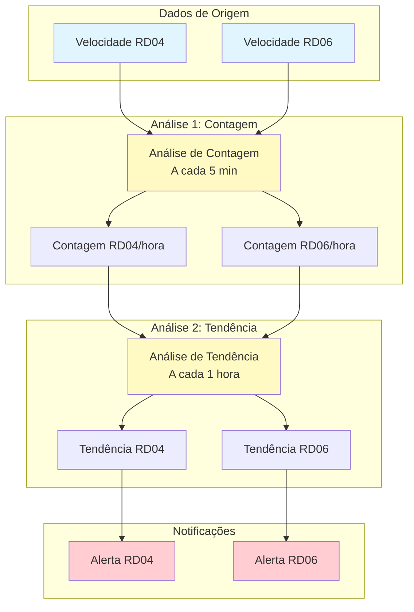
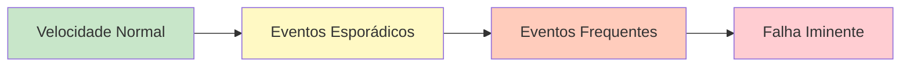
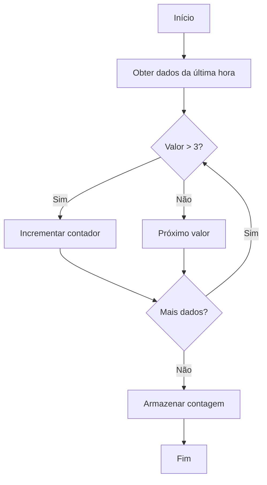
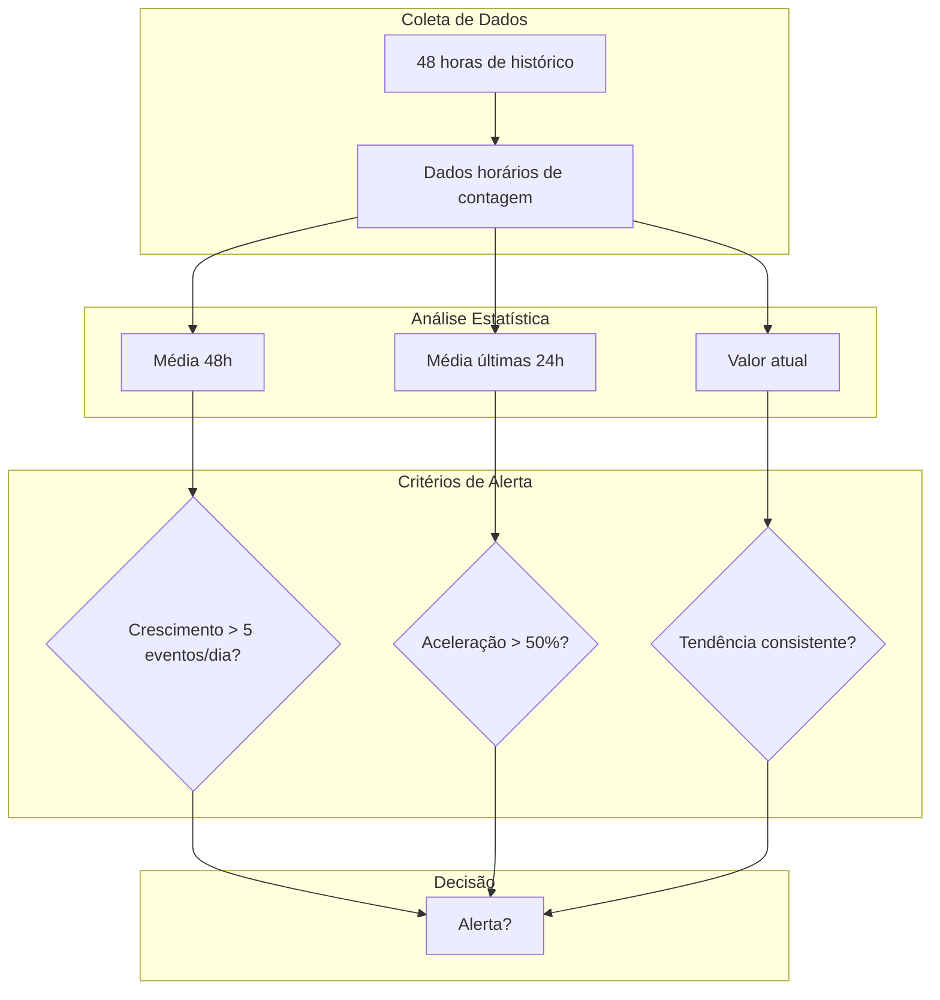
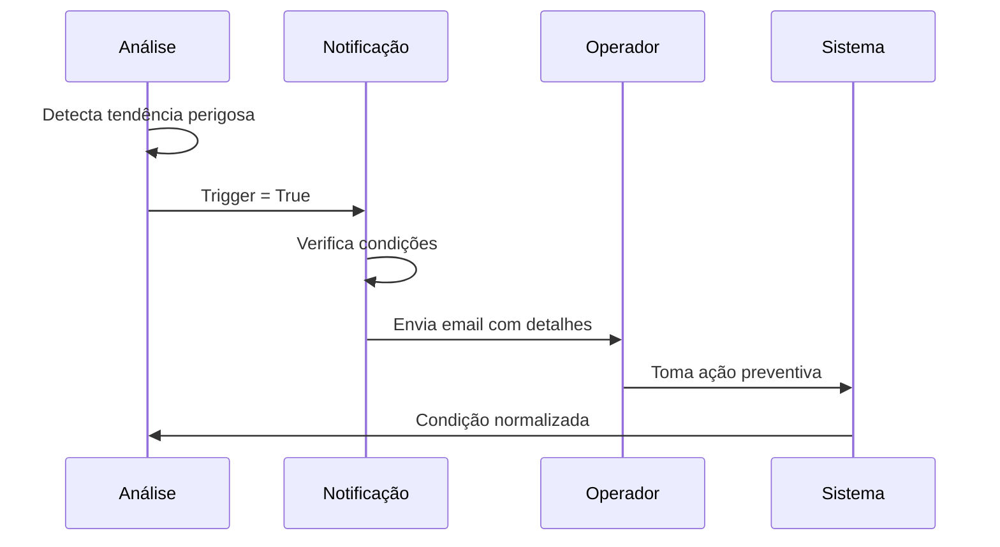
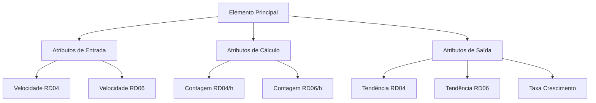
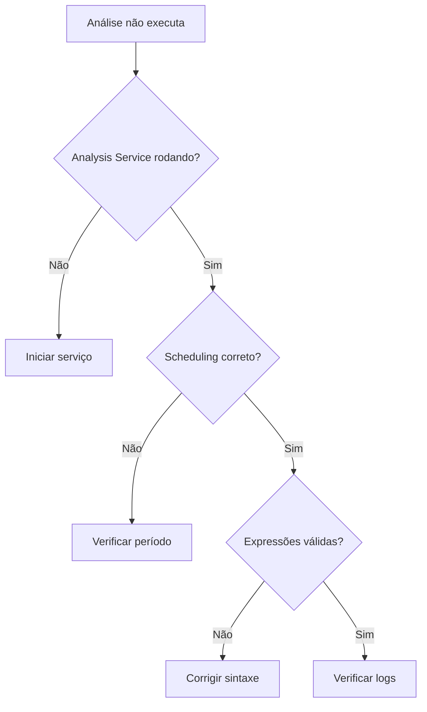

# 📊 Sistema de Monitoramento Preditivo de Velocidade - PI AF

## 📋 Índice
- [Visão Geral](#visão-geral)
- [Arquitetura do Sistema](#arquitetura-do-sistema)
- [Análise 1: Contagem de Eventos](#análise-1-contagem-de-eventos)
- [Análise 2: Detecção de Tendências](#análise-2-detecção-de-tendências)
- [Sistema de Notificações](#sistema-de-notificações)
- [Implementação Passo a Passo](#implementação-passo-a-passo)
- [Troubleshooting](#troubleshooting)

---

## 🎯 Visão Geral

### Objetivo do Sistema
Este sistema foi desenvolvido para **monitorar proativamente** equipamentos rotativos (RD04 e RD06) através da análise de velocidade horizontal, identificando **tendências de degradação** antes que falhas críticas ocorram.

### Problema que Resolve
- ⚠️ **Detecção tardia** de problemas em equipamentos rotativos
- 📈 **Falta de análise preditiva** nos dados de vibração
- 🔧 **Manutenções corretivas** caras e não planejadas

### Benefícios
- ✅ **Detecção precoce** de degradação
- ✅ **Análise estatística** de tendências
- ✅ **Alertas automáticos** para ação preventiva
- ✅ **Redução de paradas** não programadas

---

## 🏗️ Arquitetura do Sistema



### Fluxo de Dados

1. **Tags de Velocidade** → Dados brutos de vibração horizontal
2. **Análise de Contagem** → Conta eventos acima do limite (3 mm/s)
3. **Análise de Tendência** → Avalia padrão de crescimento
4. **Sistema de Notificação** → Alerta operadores sobre riscos

---

## 📊 Análise 1: Contagem de Eventos

### Conceito
Esta análise **conta quantas vezes** a velocidade horizontal excedeu o limite de **3 mm/s** na última hora.

### Por que isso importa?


### Lógica de Cálculo



### Implementação no PI AF

| Linha | Variable/Output | Expression | Explicação |
|-------|----------------|------------|------------|
| 1 | Limite | 3 | Define o limite de velocidade em mm/s |
| 2 | TempoInicio | "*-1h" | Define início da janela (1 hora atrás) |
| 3 | TempoFim | "*" | Define fim da janela (agora) |
| 4 | ContagemRD04 | EventCount('Velocidade Horizontal RD04', TempoInicio, TempoFim, ">3") | Conta eventos RD04 > 3 mm/s |
| 5 | ContagemRD06 | EventCount('Velocidade Horizontal RD06', TempoInicio, TempoFim, ">3") | Conta eventos RD06 > 3 mm/s |

### Exemplo Prático
```
Hora 08:00 - Velocidade = 2.5 mm/s ❌ (não conta)
Hora 08:15 - Velocidade = 3.2 mm/s ✅ (conta)
Hora 08:30 - Velocidade = 4.1 mm/s ✅ (conta)
Hora 08:45 - Velocidade = 2.8 mm/s ❌ (não conta)
Hora 09:00 - Velocidade = 3.5 mm/s ✅ (conta)

Resultado: ContagemRD04 = 3 eventos na última hora
```

---

## 📈 Análise 2: Detecção de Tendências

### Conceito
Esta análise identifica se o número de eventos está **crescendo de forma preocupante** ao longo do tempo.

### Metodologia de Detecção



### Implementação Detalhada

#### Parte 1: Coleta de Dados Históricos
| Linha | Variable | Expression | Explicação |
|-------|----------|------------|------------|
| 1 | DadosRD04 | RecordedValues('Contagem RD04 Ultima Hora', "*-48h", "*") | Obtém 48h de histórico |
| 2 | NumValoresRD04 | Count(DadosRD04) | Conta quantos pontos temos |
| 3 | SomaRD04 | TagTotal('Contagem RD04 Ultima Hora', "*-48h", "*") | Soma total de eventos |
| 4 | MediaRD04 | SomaRD04 / NumValoresRD04 | Calcula média do período |

#### Parte 2: Análise de Crescimento
| Linha | Variable | Expression | Explicação |
|-------|----------|------------|------------|
| 5 | UltimoRD04 | TagVal('Contagem RD04 Ultima Hora', "*") | Valor mais recente |
| 6 | RD04_24h | TagAvg('Contagem RD04 Ultima Hora', "*-24h", "*") | Média últimas 24h |
| 7 | RD04_48h | TagAvg('Contagem RD04 Ultima Hora', "*-48h", "*-24h") | Média 24-48h atrás |
| 8 | CrescRD04_24h | RD04_24h - RD04_48h | Crescimento dia anterior |
| 9 | CrescRD04_Recente | UltimoRD04 - RD04_24h | Crescimento recente |

#### Parte 3: Detecção de Padrões Perigosos
| Linha | Variable | Expression | Explicação |
|-------|----------|------------|------------|
| 23 | AceleracaoRD04 | If CrescRD04_24h > 0 Then (CrescRD04_Recente - CrescRD04_24h) / CrescRD04_24h Else 0 | Taxa de aceleração |
| 25 | AlertaRD04_Cond1 | CrescRD04_Recente > 5 | Crescimento absoluto alto |
| 26 | AlertaRD04_Cond2 | AceleracaoRD04 > 0.5 | Aceleração > 50% |
| 27 | AlertaRD04_Cond3 | CrescRD04_24h > 2 AND CrescRD04_Recente > 2 | Crescimento consistente |
| 28 | TendenciaRD04 | AlertaRD04_Cond1 OR AlertaRD04_Cond2 OR AlertaRD04_Cond3 | Qualquer condição = alerta |

### Critérios de Alerta Explicados

#### 🔴 Condição 1: Crescimento Absoluto
```
Se (Eventos recentes - Média 24h) > 5
Então → ALERTA

Exemplo: Média era 10 eventos/hora, agora está em 16 eventos/hora
```

#### 🟡 Condição 2: Aceleração
```
Se Taxa de Aceleração > 50%
Então → ALERTA

Exemplo: 
- Ontem: crescimento de 2 eventos/hora
- Hoje: crescimento de 4 eventos/hora
- Aceleração = 100% → ALERTA!
```

#### 🟠 Condição 3: Crescimento Consistente
```
Se crescimento > 2 por dois dias consecutivos
Então → ALERTA

Exemplo: Segunda +3, Terça +3 → Padrão consistente!
```

---

## 🚨 Sistema de Notificações

### Configuração de Alertas



### Template de Email

```markdown
Assunto: 🚨 ALERTA - Tendência Crescente em [EQUIPAMENTO] Detectada

━━━━━━━━━━━━━━━━━━━━━━━━━━━━━━━━━━━━━━━━━
⚠️ AÇÃO IMEDIATA REQUERIDA
━━━━━━━━━━━━━━━━━━━━━━━━━━━━━━━━━━━━━━━━━

EQUIPAMENTO: [RD04/RD06]
HORÁRIO: [Timestamp]

📊 ANÁLISE DA TENDÊNCIA:
• Contagem atual: [X] eventos/hora
• Média 24h: [Y] eventos/hora  
• Taxa de crescimento: [Z] eventos/dia
• Aceleração detectada: [W]%

📈 GRÁFICO DE TENDÊNCIA:
[Link para PI Vision]

🔧 AÇÕES RECOMENDADAS:
1. Verificar vibração e temperatura imediatamente
2. Inspecionar alinhamento e balanceamento
3. Avaliar condição dos rolamentos
4. Considerar redução de carga operacional

━━━━━━━━━━━━━━━━━━━━━━━━━━━━━━━━━━━━━━━━━
Sistema de Monitoramento Preditivo PI AF
```

---

## 🛠️ Implementação Passo a Passo

### Pré-requisitos
- [ ] PI AF 2016 ou superior
- [ ] PI Analysis Service instalado
- [ ] Acesso de escrita aos PI Points
- [ ] Configuração de email no PI Notifications

### Passo 1: Criar Estrutura de Atributos



### Passo 2: Configurar Análises
1. **Abrir PI System Explorer**
2. **Navegar até o elemento**
3. **Criar nova análise** (botão direito → Analyses → New)
4. **Inserir expressões** conforme tabelas acima
5. **Mapear outputs** para atributos
6. **Configurar scheduling**
7. **Testar e validar**

### Passo 3: Configurar Notificações
1. **Criar Notification Rule**
2. **Definir trigger**: `Tendencia RD04 Detectada = true`
3. **Configurar destinatários**
4. **Personalizar mensagem**
5. **Testar com valores simulados**

---

## 🔍 Troubleshooting

### Problema: Análise não executa


### Problema: Muitos falsos alertas
- **Ajustar limites**: Aumentar de 5 para 10 eventos/dia
- **Adicionar filtros**: Considerar apenas horário de operação
- **Refinar critérios**: Exigir 2 de 3 condições verdadeiras

### Problema: Alertas não chegam
1. Verificar configuração SMTP
2. Confirmar endereços de email
3. Checar logs do PI Notifications
4. Testar com trigger manual

---

## 📚 Referências e Recursos

- [PI AF Analysis Reference Guide](https://docs.osisoft.com)
- [PI Notifications User Guide](https://docs.osisoft.com)
- [Best Practices for Asset Analytics](https://pisquare.osisoft.com)

---

## 🤝 Contribuições

Para sugestões ou melhorias nesta documentação:
1. Faça um fork do repositório
2. Crie uma branch para sua feature
3. Commit suas mudanças
4. Push para a branch
5. Abra um Pull Request

---

**Última atualização:** Maio 2025  
**Versão:** 1.0  
**Autor:** Wonder DataLabs (dmercadal@wonderdatalabs.com)
