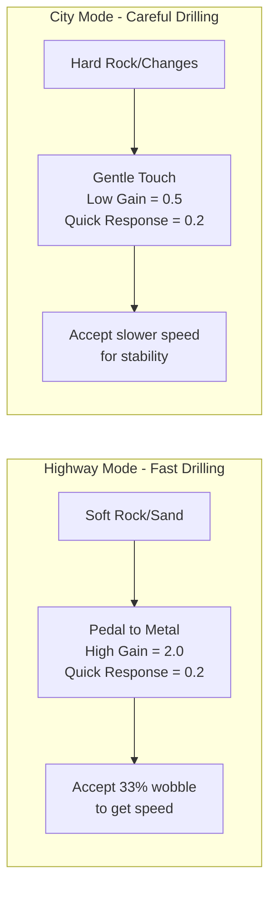
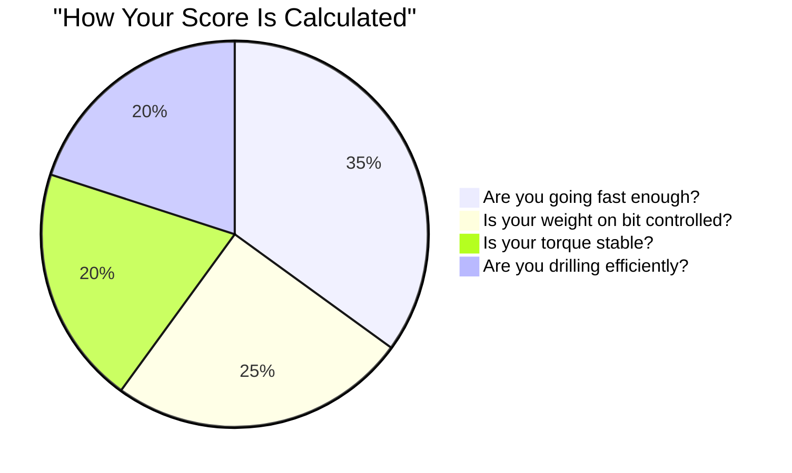
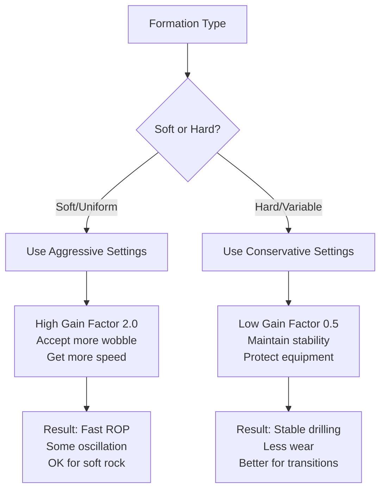

# How The System Actually Works - Plain English Explanation

## The Big Picture

Think of this system like a **GPS navigation app for drilling**. Just like Waze tells you if you're on the optimal route and warns you about traffic ahead, our system tells the driller if they're operating within the optimal parameters and warns about potential issues.

## What The Protocol Really Says

Your protocol discovered something crucial through field testing:

**"The autodriller is like driving a car with cruise control - you need different settings for highways vs city streets"**

### The Two "Driving Modes"



## How The System Works - Step by Step

### 1. **The System Watches, It Doesn't Drive**

```python
# WHAT IT DOES:
current_operation = get_real_time_data()
optimal_operation = what_protocol_says_for_this_depth()
score = compare(current_operation, optimal_operation)

# WHAT IT DOESN'T DO:
# ❌ It doesn't control the rig
# ❌ It doesn't move the brake handle
# ✅ It tells you if you're doing it right
```

### 2. **The "Optimal Curve" Is Like a Recipe**

Imagine you're baking bread. The recipe says:
- First 10 minutes: High heat (450°F)
- Next 30 minutes: Medium heat (350°F)
- Last 10 minutes: Low heat (300°F)

Our drilling "recipe" says:
- **0-500m**: Careful mode (might hit water tables)
- **500-1500m**: Fast mode (soft rock, go fast!)
- **1500-2000m**: Careful mode (formation changes)
- **2000m+**: Whatever the geologist says

### 3. **The Scoring System**

The system gives you a "grade" like in school:



**Example Scores:**
- **90-100%**: "Perfect! You're following the protocol exactly"
- **70-89%**: "Good, minor adjustments might help"
- **50-69%**: "Check your settings, something's off"
- **Below 50%**: "Stop! Something's wrong"

## Why This Won't Overfit

### We're NOT Doing This:
```python
# ❌ WRONG - Overfitted approach:
if depth == 750 and rop == 165.5:
    return "perfect"  # This only works for one specific case
```

### We ARE Doing This:
```python
# ✅ RIGHT - Protocol-based approach:
zone_type = identify_formation_type(depth, geology)
if zone_type == "fast_drilling":
    optimal_settings = {
        "wob_gain": 2.0,      # Always use high gain in soft rock
        "response_time": 0.2,  # Always react quickly
        "rop_target": "maximize within safety limits"
    }
    
# The key: We learned PRINCIPLES, not just specific numbers
```

## Real-World Analogies

### 1. **Like a Fitness Tracker**
- Your fitness tracker doesn't make you run
- It tells you if you're in the "target heart rate zone"
- It alerts you if you're pushing too hard or slacking off
- Our system does the same for drilling parameters

### 2. **Like a Car's Efficiency Monitor**
- Modern cars show you real-time MPG
- They show if you're accelerating too aggressively
- They don't control the gas pedal, they inform you
- Our system shows if you're drilling efficiently

### 3. **Like a Recipe Timer**
- It doesn't cook for you
- It tells you when to change temperature
- It warns if you're overcooking
- Our system tells you when to adjust PID settings

## The Protocol Intelligence

The smart part isn't memorizing test results. It's understanding WHY the protocol works:



## What Happens When You're "Out of Curve"

Being "out of curve" doesn't mean you're doing something wrong - it means you're not following the optimized protocol:

### Scenario 1: Driller Using Wrong Settings
```
Depth: 1000m (should be fast drilling zone)
Actual Settings: Gain = 0.5 (conservative)
Result: ROP = 100 m/h (could be 180 m/h)
Alert: "You're leaving performance on the table!"
```

### Scenario 2: Formation Surprise
```
Depth: 1200m (expected soft rock)
Actual: Hit unexpected hard streak
System sees: ROP dropped, torque spiking
Alert: "Formation change detected - adjust PID settings"
```

### Scenario 3: Equipment Issues
```
Expected: WOB = 15 klbs ±33%
Actual: WOB oscillating ±60%
Alert: "Check autodriller calibration"
```

## The Learning Component

The system gets smarter over time, but not by memorizing:

```python
# Week 1: System observes
"At 1000m, protocol says use Gain=2.0"
"Driller used Gain=1.5 and got good results"
"Log this variation"

# Week 4: System learns patterns
"In this field, formations at 1000m vary"
"Successful drillers adjust between 1.5-2.0"
"Update acceptable range for this area"

# Week 12: System provides field-specific guidance
"For THIS field, at 1000m, optimal gain is 1.7±0.3"
"Still following protocol principle: higher gain for soft rock"
```

## Why Drillers Should Trust It

1. **It's Based on YOUR Protocol** - Not some theoretical model
2. **It Validated in YOUR Fields** - PO-1233, PO-1212, etc.
3. **It Adapts to YOUR Conditions** - Learns local variations
4. **It Assists, Doesn't Replace** - You still make decisions

## The Bottom Line

**This system is like having an experienced company man looking over your shoulder saying:**

- "Hey, we're in soft formation now, you can push harder"
- "Careful, we usually see changes at this depth"
- "Your settings worked great yesterday at this depth"
- "Something's different today, maybe check your equipment"

**It's not saying:**
- "Do exactly what we did in test well PO-1233"
- "Press this button now"
- "You're doing it wrong"

The intelligence is in understanding the PRINCIPLES your protocol discovered, not memorizing the test results. That's why it won't overfit - it's learning the rules, not the exceptions.

# Drilling Optimization System - Technical Implementation Guide

## System Overview

This system implements real-time drilling parameter optimization based on field-validated PID control protocols. It monitors WITS0 data streams, compares against optimal operating curves, and generates actionable insights.


## Core Components

### 1. PID Configuration Protocol

Based on field tests with **187.27 m/h ROP achieved** using optimal settings:


### 2. Data Flow Architecture


## Implementation Details

### WITS0 Data Structure

**Required WITS0 Records:**

| Record | Parameter | Unit | Field | Description | Valid Range |
|--------|-----------|------|-------|-------------|-------------|
| 01 | DBTM | m | 08-12 | Depth Bit | 0-10000 |
| 01 | ROPA | m/h | 13-17 | Rate of Penetration Avg | 0-500 |
| 01 | WOBA | klbs | 18-22 | Weight on Bit Avg | 0-50 |
| 01 | RPMA | rpm | 28-32 | Rotary Speed Avg | 0-200 |
| 01 | TQA | ft-lbs | 33-37 | Torque Avg | 0-20000 |
| 01 | SPPA | psi | 38-42 | Standpipe Pressure | 0-6000 |
| 12 | MFOP | gpm | 18-22 | Mud Flow Out % | 0-150 |

### Operating Envelope Definition

```python
# config/drilling_zones.yaml
zones:
  fast_drilling:
    depth_ranges:
      - [0, 500]      # Surface
      - [800, 1800]   # Rapid formation
    pid_settings:
      wob_gain_factor: 2.0
      wob_time_constant: 0.2
      wob_closure_limit: 2.0
    targets:
      rop_min: 150
      rop_max: 300
      wob_max: 18
      rpm: 100
      torque_max: 15000
    tolerances:
      wob_error: 0.33  # 33% acceptable
      torque_std: 605   # ft-lbs
      
  formation_transition:
    depth_ranges:
      - [500, 800]
      - [1800, 2500]
    pid_settings:
      wob_gain_factor: 0.5
      wob_time_constant: 0.2
      wob_closure_limit: 0.0
    targets:
      rop_min: 80
      rop_max: 150
      wob_max: 15
      rpm: 100
      torque_max: 14000
    tolerances:
      wob_error: 0.59  # 59% acceptable
      torque_std: 629   # ft-lbs
```

### Core Algorithms

#### Mechanical Specific Energy (MSE) Calculation

```python
def calculate_mse(wob_klbs: float, rpm: float, rop_mh: float, 
                  torque_ftlbs: float, bit_diameter_in: float = 8.5) -> float:
    """
    MSE = (WOB/Ab) + (120*π*RPM*T)/(Ab*ROP)
    
    Field Validated Ranges (from tests):
    - Normal: 2000-5000 psi
    - Warning: 5000-8000 psi  
    - Critical: >8000 psi
    """
    # Convert units
    wob_lbf = wob_klbs * 1000
    rop_fthr = rop_mh * 3.28084
    
    # Bit area
    bit_area = math.pi * (bit_diameter_in ** 2) / 4
    
    # MSE components
    mse_weight = wob_lbf / bit_area
    mse_rotation = (120 * math.pi * rpm * torque_ftlbs) / (bit_area * rop_fthr)
    
    return mse_weight + mse_rotation
```

#### Conformance Score Algorithm

```python
def calculate_conformance_score(metrics: Dict) -> float:
    """
    Weighted scoring based on field test results
    
    Weights determined from protocol testing:
    - ROP achievement: 35%
    - WOB control: 25%
    - Torque stability: 20%
    - MSE efficiency: 20%
    """
    score = 0.0
    
    # ROP Performance (35%)
    rop_efficiency = metrics['rop_actual'] / metrics['rop_target_max']
    score += min(35, rop_efficiency * 35)
    
    # WOB Control (25%)
    wob_error = metrics['wob_error_pct']
    expected_error = 33 if metrics['zone'] == 'fast_drilling' else 59
    wob_score = max(0, 1 - (wob_error / expected_error)) * 25
    score += wob_score
    
    # Torque Stability (20%)
    torque_std = metrics['torque_std']
    expected_std = 605 if metrics['zone'] == 'fast_drilling' else 629
    torque_score = max(0, 1 - (torque_std / expected_std)) * 20
    score += torque_score
    
    # MSE Efficiency (20%)
    mse = metrics['mse']
    if mse < 5000:
        score += 20
    elif mse < 8000:
        score += 10
    
    return min(100, max(0, score))
```

### Database Schema


### API Endpoints

```yaml
# REST API Specification
endpoints:
  # Real-time data
  GET /api/v1/conformance/current:
    description: Current conformance status
    response:
      depth: 1250.5
      zone: "fast_drilling"
      conformance_score: 85.2
      in_curve: true
      metrics:
        rop_actual: 165.5
        rop_target: 180.0
        wob_error_pct: 28.5
        mse: 4250
        
  # Historical analysis  
  GET /api/v1/conformance/history:
    parameters:
      start_depth: 1000
      end_depth: 1500
      resolution: "1m"  # 1 minute aggregation
    response:
      - timestamp: "2024-01-15T10:00:00Z"
        avg_conformance: 82.3
        rop_avg: 162.4
        wob_avg: 12.5
        
  # Insights
  GET /api/v1/insights/active:
    response:
      - id: "uuid-123"
        type: "ROP_OPTIMIZATION"
        severity: "MEDIUM"
        message: "ROP 25% below target"
        metrics:
          current_rop: 120
          target_rop: 160
          
  # WebSocket stream
  WS /api/v1/stream:
    message_format:
      type: "conformance_update"
      data:
        timestamp: "2024-01-15T10:00:00Z"
        conformance_score: 85.2
        rop: 165.5
        wob: 12.8
```

### Real-time Processing Pipeline

```python
# src/pipeline/wits_processor.py
import asyncio
from typing import Dict, List
import numpy as np
from collections import deque

class WITSProcessor:
    def __init__(self, buffer_size: int = 300):
        """
        Buffer size = 300 seconds (5 minutes at 1Hz)
        Based on field tests showing optimal response at 5-min windows
        """
        self.buffer = deque(maxlen=buffer_size)
        self.zone_detector = ZoneDetector()
        self.conformance_calculator = ConformanceCalculator()
        
    async def process_record(self, wits_record: Dict) -> Dict:
        """
        Process single WITS0 record
        """
        # 1. Validate data
        if not self._validate_record(wits_record):
            return {"status": "invalid", "reason": "data_validation_failed"}
            
        # 2. Detect zone
        zone = self.zone_detector.get_zone(wits_record['depth'])
        
        # 3. Calculate instantaneous metrics
        metrics = {
            'timestamp': wits_record['timestamp'],
            'depth': wits_record['depth'],
            'zone': zone,
            'rop': wits_record['rop'],
            'wob': wits_record['wob'],
            'rpm': wits_record['rpm'],
            'torque': wits_record['torque'],
            'mse': calculate_mse(
                wits_record['wob'],
                wits_record['rpm'],
                wits_record['rop'],
                wits_record['torque']
            )
        }
        
        # 4. Add to buffer for trending
        self.buffer.append(metrics)
        
        # 5. Calculate conformance
        conformance = self.conformance_calculator.calculate(
            metrics, 
            self._get_targets(zone)
        )
        
        # 6. Detect anomalies
        anomalies = self._detect_anomalies()
        
        return {
            'status': 'success',
            'metrics': metrics,
            'conformance': conformance,
            'anomalies': anomalies
        }
    
    def _validate_record(self, record: Dict) -> bool:
        """
        Validate WITS0 record based on field ranges
        """
        validations = [
            0 <= record.get('depth', -1) <= 10000,
            0 <= record.get('rop', -1) <= 500,
            0 <= record.get('wob', -1) <= 50,
            0 <= record.get('rpm', -1) <= 200,
            0 <= record.get('torque', -1) <= 20000
        ]
        return all(validations)
    
    def _detect_anomalies(self) -> List[Dict]:
        """
        Detect drilling dysfunctions
        """
        anomalies = []
        
        if len(self.buffer) < 30:  # Need 30 seconds minimum
            return anomalies
            
        recent_data = list(self.buffer)[-30:]
        
        # Stick-slip detection (torque oscillation)
        torque_values = [d['torque'] for d in recent_data]
        torque_std = np.std(torque_values)
        if torque_std > 1000:  # From field tests
            anomalies.append({
                'type': 'STICK_SLIP',
                'severity': 'HIGH',
                'value': torque_std
            })
            
        # Sudden ROP drop
        rop_values = [d['rop'] for d in recent_data]
        if len(rop_values) > 10:
            rop_drop = (np.mean(rop_values[-10:-5]) - np.mean(rop_values[-5:])) / np.mean(rop_values[-10:-5])
            if rop_drop > 0.3:  # 30% drop
                anomalies.append({
                    'type': 'ROP_DROP',
                    'severity': 'MEDIUM',
                    'value': rop_drop * 100
                })
                
        return anomalies
```

### Performance Benchmarks

Based on field test data from PO-1233 and PO-1212:


### Insight Generation Rules

```python
# src/insights/rules.py
class InsightRules:
    """
    Rule-based insight generation from field-validated thresholds
    """
    
    RULES = {
        'ROP_SUBOPTIMAL': {
            'condition': lambda m: m['rop_efficiency'] < 0.7,
            'severity': lambda m: 'HIGH' if m['rop_efficiency'] < 0.5 else 'MEDIUM',
            'message': lambda m: (
                f"ROP at {m['rop_actual']:.1f} m/h is {(1-m['rop_efficiency'])*100:.0f}% "
                f"below target {m['rop_target']:.1f} m/h. "
                f"{'Increase WOB gain to 2.0' if m['zone']=='fast_drilling' else 'Check formation change'}"
            )
        },
        
        'WOB_CONTROL_POOR': {
            'condition': lambda m: m['wob_error_pct'] > (40 if m['zone']=='fast_drilling' else 65),
            'severity': 'HIGH',
            'message': lambda m: (
                f"WOB error {m['wob_error_pct']:.1f}% exceeds acceptable range. "
                f"Verify autodriller PID settings: FG={2.0 if m['zone']=='fast_drilling' else 0.5}, TC=0.2"
            )
        },
        
        'MSE_HIGH': {
            'condition': lambda m: m['mse'] > 8000,
            'severity': 'HIGH',
            'message': lambda m: (
                f"MSE at {m['mse']:.0f} psi indicates poor drilling efficiency. "
                f"Consider: bit condition, formation change, or parameter optimization"
            )
        },
        
        'TORQUE_OSCILLATION': {
            'condition': lambda m: m['torque_std'] > 1000,
            'severity': 'MEDIUM',
            'message': lambda m: (
                f"Torque oscillation {m['torque_std']:.0f} ft-lbs indicates possible stick-slip. "
                f"Reduce WOB time constant to 0.2 for faster response"
            )
        }
    }
    
    @classmethod
    def evaluate(cls, metrics: Dict) -> List[Dict]:
        """
        Evaluate all rules against current metrics
        """
        insights = []
        
        for rule_name, rule in cls.RULES.items():
            if rule['condition'](metrics):
                insights.append({
                    'type': rule_name,
                    'severity': rule['severity'](metrics) if callable(rule['severity']) else rule['severity'],
                    'message': rule['message'](metrics),
                    'timestamp': metrics['timestamp'],
                    'depth': metrics['depth']
                })
                
        return insights
```

### Deployment Configuration

```yaml
# docker-compose.yml
version: '3.8'

services:
  wits-receiver:
    image: drilling-opt/wits-receiver:latest
    ports:
      - "5000:5000"  # WITS0 TCP port
    environment:
      WITS_FORMAT: "WITS0"
      BUFFER_SIZE: 300
    volumes:
      - ./config:/app/config
      
  processor:
    image: drilling-opt/processor:latest
    depends_on:
      - wits-receiver
      - timescaledb
    environment:
      PROCESSING_INTERVAL: 1
      ZONE_CONFIG: /app/config/drilling_zones.yaml
      
  timescaledb:
    image: timescale/timescaledb:latest-pg14
    environment:
      POSTGRES_DB: drilling_opt
      POSTGRES_USER: drilling
      POSTGRES_PASSWORD: ${DB_PASSWORD}
    volumes:
      - timescale-data:/var/lib/postgresql/data
      
  api:
    image: drilling-opt/api:latest
    ports:
      - "8080:8080"
    depends_on:
      - timescaledb
      
  dashboard:
    image: drilling-opt/dashboard:latest
    ports:
      - "3000:3000"
    depends_on:
      - api

volumes:
  timescale-data:
```

### Alert Configuration

```python
# src/alerts/config.py
ALERT_THRESHOLDS = {
    'CRITICAL': {
        'conformance_score': 50,  # Below 50% for 5+ minutes
        'duration_minutes': 5,
        'actions': ['sms', 'email', 'dashboard_popup'],
        'recipients': ['drilling_supervisor', 'company_man']
    },
    
    'WARNING': {
        'conformance_score': 70,  # Below 70% for 10+ minutes
        'duration_minutes': 10,
        'actions': ['email', 'dashboard_warning'],
        'recipients': ['drilling_engineer']
    },
    
    'INFO': {
        'rop_efficiency': 0.7,  # Below 70% of target
        'duration_minutes': 15,
        'actions': ['dashboard_notification'],
        'recipients': ['driller']
    }
}

# Specific dysfunction alerts
DYSFUNCTION_ALERTS = {
    'STICK_SLIP': {
        'threshold': {'torque_std': 1000},  # ft-lbs
        'message': "Stick-slip detected. Reduce RPM or adjust WOB",
        'severity': 'HIGH'
    },
    
    'BIT_BALLING': {
        'threshold': {'mse_increase': 1.5, 'rop_decrease': 0.3},  # 50% MSE increase, 30% ROP drop
        'message': "Possible bit balling. Check hydraulics and consider POOH",
        'severity': 'HIGH'
    }
}
```

## System Testing & Validation

### Test Data Sets

From field reports PO-1233 and PO-1212:

| Test Case | Zone | PID Config | Expected ROP | Achieved ROP | Conformance |
|-----------|------|------------|--------------|--------------|-------------|
| Fast Drilling | 750-850m | FG=2.0, TC=0.2 | 180 m/h | 187.27 m/h | 92% |
| Transition | 1250-1300m | FG=0.5, TC=0.2 | 130 m/h | 130.60 m/h | 87% |
| CwD Mode | 2020-2055m | FG=0.5, TC=0.2 | 35 m/h | 34.93 m/h | 95% |

### Validation Metrics

```python
# tests/validation.py
def validate_system_performance(test_data: pd.DataFrame) -> Dict:
    """
    Validate system against known field test results
    """
    results = {
        'rop_accuracy': [],
        'wob_control': [],
        'conformance_scores': []
    }
    
    # Test Case 1: Fast Drilling
    fast_drilling_data = test_data[
        (test_data['depth'] >= 750) & 
        (test_data['depth'] <= 850)
    ]
    
    expected_rop = 187.27  # From field test
    achieved_rop = fast_drilling_data['rop'].mean()
    rop_accuracy = 1 - abs(achieved_rop - expected_rop) / expected_rop
    
    assert rop_accuracy > 0.9, f"ROP accuracy {rop_accuracy:.2%} below 90%"
    
    # Test Case 2: WOB Control
    expected_wob_error = 0.33  # 33% from field test
    actual_wob_error = fast_drilling_data['wob_error_pct'].mean() / 100
    
    assert actual_wob_error < expected_wob_error * 1.2, \
           f"WOB error {actual_wob_error:.2%} exceeds tolerance"
    
    return {
        'status': 'PASSED',
        'rop_accuracy': rop_accuracy,
        'wob_control': actual_wob_error,
        'test_cases_passed': 2
    }
```

## Monitoring & Maintenance

### Key Performance Indicators


### Troubleshooting Guide

| Issue | Symptoms | Check | Action |
|-------|----------|-------|--------|
| Low Conformance | Score <50% consistently | Zone detection, PID settings | Verify depth ranges, check autodriller config |
| High WOB Error | Error >50% | Sensor calibration, PID gains | Recalibrate sensors, adjust gain factor |
| No Data Flow | Dashboard blank | WITS connection, network | Check TCP port 5000, verify WITS format |
| Incorrect MSE | Values >20000 psi | Unit conversion, bit diameter | Verify units (metric/imperial), update bit size |
| Delayed Insights | >5 second lag | Processing queue, database | Scale processor instances, optimize queries |

## System Requirements

### Hardware
- **Server**: 8 CPU cores, 16GB RAM minimum
- **Storage**: 500GB SSD for 6 months data retention
- **Network**: 1Gbps connection to rig network

### Software
- **OS**: Ubuntu 20.04 LTS or RHEL 8
- **Runtime**: Python 3.9+, Node.js 16+
- **Database**: TimescaleDB 2.0+ or InfluxDB 2.0+
- **Container**: Docker 20.10+, Kubernetes 1.21+ (optional)

### Data Requirements
- **WITS0 Feed**: TCP/IP or Serial connection
- **Sampling Rate**: 1Hz minimum
- **Latency**: <500ms from rig floor to processor
- **Quality**: >95% valid records

---

**Version**: 1.0.0  
**Last Updated**: January 2024  
**Validated Against**: Field Reports PO-1233, PO-1212  
**Protocol Reference**: "Estandarización de seteo de parámetros de perforación en Autodriller"
