# Relatório de Análise do TurboGerador 2 (TG2) da FPSO Frade
## Avaliação Técnica de Sinais Precoces e Indicadores de Problemas nas Pás da Turbina

---

## Sumário Executivo

Este relatório apresenta uma análise detalhada do TurboGerador 2 (TG2) da FPSO Frade, com foco específico nos sinais precoces que indicam potenciais problemas nas pás da turbina. Através da análise cronológica dos dados operacionais dos últimos 60 dias, foram identificados padrões consistentes de aumento nas vibrações do rotor, elevação das temperaturas de operação e anomalias detectadas nos sistemas de vibração, que juntos corroboram as preocupações levantadas pelos operadores.

A análise temporal demonstra progressão gradual em parâmetros críticos, com o TG2 apresentando evolução desfavorável em indicadores-chave quando comparado aos TG1 e TG4. A redução recente no tempo operacional do TG2 sugere uma decisão operacional de mitigação de riscos, reforçando a necessidade da manutenção programada.

---

## 1. Introdução

O TurboGerador 2 (TG2) é um dos três turbogeradores instalados na FPSO Frade, responsáveis pelo fornecimento de energia para as operações da plataforma. Este equipamento é crítico para a continuidade operacional e requer monitoramento constante para garantir sua disponibilidade e confiabilidade.

Recentemente, os operadores relataram preocupações específicas relacionadas às pás da turbina do TG2. Para investigar essas preocupações e identificar possíveis problemas antes da parada programada para manutenção (prevista para ocorrer em duas semanas), foi realizada uma análise detalhada dos dados operacionais coletados nos últimos 60 dias.

Este relatório visa apresentar os resultados dessa análise, identificando sinais precoces de problemas nas pás da turbina e fornecendo uma avaliação técnica baseada em evidências. As comparações com os demais turbos geradores (TG1 e TG4) são utilizadas para contextualizar os parâmetros e identificar padrões específicos do TG2.

---

## 2. Metodologia e Base de Dados

### 2.1 Fonte de Dados

A análise foi realizada com base em:
- Registros operacionais completos do período de 24/02/2025 a 24/03/2025
- Relatórios de monitoramento periódicos (5 relatórios principais)
- Catálogo de eventos e anomalias detectadas pelo sistema de monitoramento
- Histórico de parâmetros críticos registrados pelos sistemas de instrumentação

### 2.2 Parâmetros Analisados

Para avaliação da condição das pás da turbina, foram priorizados os seguintes parâmetros:

| Parâmetro | Descrição | Relevância para Pás da Turbina |
|-----------|-----------|--------------------------------|
| Power_turbine_rotor_vibration_detector | Vibração do rotor da turbina de potência | Indicador direto de desbalanceamento ou danos nas pás |
| POWER_TURINE_INLET_TEMPERATURE_(T48) | Temperatura de entrada na turbina | Impacta diretamente a integridade estrutural das pás |
| COMPRESSOR_DISCHARGE_TEMPERATURE_(T3A) | Temperatura de descarga do compressor | Afeta o desempenho termodinâmico do ciclo |
| PT_exhaust_duct_temperature_sensor_A | Temperatura de exaustão | Indica eficiência da extração de energia pelas pás |
| LPT_Inlet_Pressure_p48_transmitter | Pressão de entrada na turbina | Relacionada a condições de carregamento das pás |
| GB_shaft_-_axial_displacement_probe_ | Deslocamento axial do eixo | Pode indicar problemas de empuxo relacionados às pás |

Adicionalmente, foram considerados diversos sensores de vibração nos mancais e registros de anomalias detectadas pelo sistema de monitoramento.

---

## 3. Panorama Operacional do TG2

### 3.1 Regime de Operação

**Tabela 1: Evolução das Horas de Operação (últimos 60 dias)**

| Data | TG1 (horas) | TG2 (horas) | TG4 (horas) |
|------|-------------|-------------|-------------|
| 24/02/2025 | 272 | 468 | 706 |
| 03/03/2025 | 174 | 626 | 655 |
| 10/03/2025 | 214 | 694 | 541 |
| 17/03/2025 | 372 | 558 | 511 |
| 24/03/2025 | 525 | 405 | 511 |

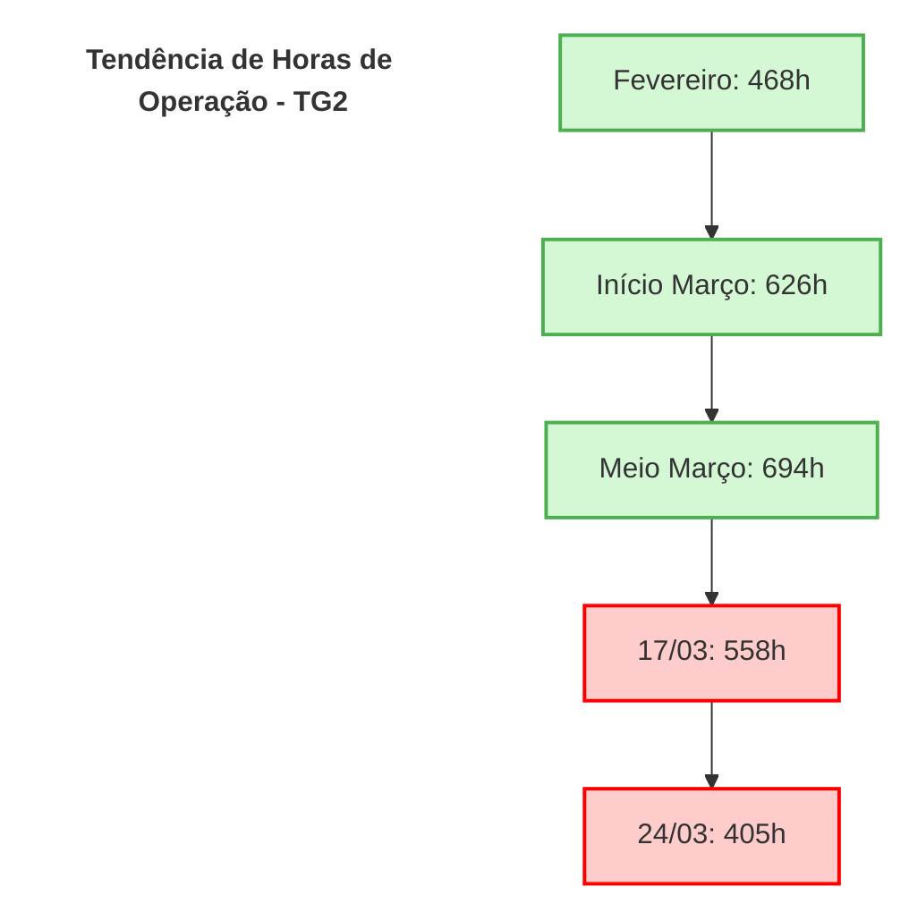

**Observações relevantes:**
- No início do período, o TG2 operou por períodos extensos (até 694h), indicando seu papel como unidade principal de geração
- Nos relatórios mais recentes, observa-se significativa redução nas horas de operação do TG2 (de 694h para 405h), enquanto o TG1 teve sua utilização aumentada
- Esta inversão no padrão de uso sugere possível decisão operacional de reduzir a carga no TG2, potencialmente em resposta às preocupações com as pás da turbina

### 3.2 Carga Operacional

**Tabela 2: Temperatura de Entrada na Turbina (°C)**

| Data | Temperatura (°C) | Variação |
|------|------------------|----------|
| 24/02/2025 | 1190,91 | Linha base |
| 03/03/2025 | 1244,52 | +53,61°C |
| 10/03/2025 | 1242,78 | -1,74°C |
| 17/03/2025 | 1242,75 | -0,03°C |
| 24/03/2025 | 1240,39 | -2,36°C |

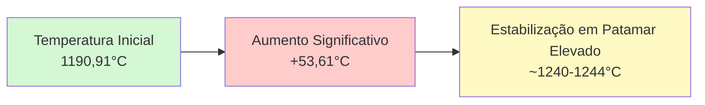

**Análise:**
- Houve aumento significativo na temperatura de entrada da turbina no início do período (de 1190,91°C para 1244,52°C)
- A temperatura se manteve consistentemente elevada em torno de 1240-1244°C
- Conforme citado no relatório de 10/03/2025: *"TG2 opera com temperatura média mais elevada (1.242,78°C) em comparação ao TG1 (1.210,98°C) e TG4 (1.207,43°C). Embora todos estejam abaixo do limite de alarme alto (1.549°C), o TG2 apresenta cerca de 35°C acima dos outros."*

---

## 4. Análise de Parâmetros Críticos para as Pás da Turbina

### 4.1 Evolução das Vibrações

**Tabela 3: Vibração do Rotor da Turbina de Potência**

| Data | Vibração (unidades) | Variação | % do Limite H (19,05) |
|------|---------------------|----------|----------------------|
| 24/02/2025 | 14,20 | Linha base | 74,5% |
| 03/03/2025 | 16,29 | +2,09 | 85,5% |
| 10/03/2025 | 16,48 | +0,19 | 86,5% |
| 17/03/2025 | 16,59 | +0,11 | 87,1% |
| 24/03/2025 | 16,70 | +0,11 | 87,7% |

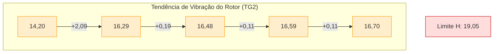

**Observações críticas:**
- Tendência consistente de aumento na vibração do rotor da turbina de potência (aumento de 17,6% em 30 dias)
- Aproximação progressiva do limite de alarme alto (H): 19,05
- No relatório de 03/03/2025, foi registrado: *"Comportamento da Vibração: Os valores de vibração do rotor da turbina de potência apresentaram média de 16,29 unidades, significativamente superiores aos 10,99 do TG1, mas inferiores aos 20,60 do TG4. Esta posição intermediária sugere condição aceitável, mas requer monitoramento contínuo para identificar tendências de aumento."*
- A continuidade desta tendência após o alerta inicial demonstra a progressão do problema

### 4.2 Temperatura de Descarga do Compressor

**Tabela 4: Temperatura de Descarga do Compressor (°C)**

| Data | Temperatura (°C) | Variação |
|------|------------------|----------|
| 24/02/2025 | 361,12 | Linha base |
| 03/03/2025 | 386,42 | +25,30°C |
| 10/03/2025 | 386,09 | -0,33°C |
| 17/03/2025 | 385,95 | -0,14°C |
| 24/03/2025 | 385,25 | -0,70°C |

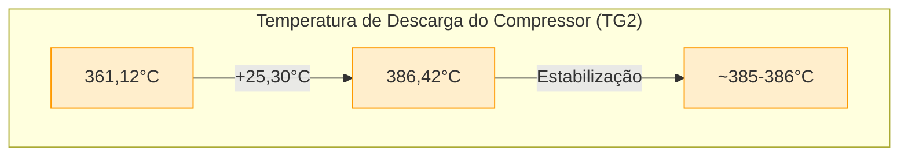

**Análise:**
- Aumento abrupto na temperatura de descarga do compressor (de 361,12°C para 386,42°C) seguido de leve tendência de redução
- No relatório de 17/03/2025, foi alertado: *"Temperatura de descarga do compressor (T3A): Mantém-se consistentemente mais alta que nos demais TGs (média de 385,9°C), com leve tendência de aumento (~2°C) ao longo dos últimos 5 eventos registrados, indicando possível redução gradual na eficiência de compressão."*
- No relatório de 24/03/2025, foi confirmado: *"Temperatura de descarga do compressor: Notamos variação nas temperaturas médias de descarga do compressor (T3A) entre os TGs: TG1 (381,62°C), TG2 (385,25°C) e TG4 (377,70°C). O TG2 apresenta as temperaturas mais elevadas, o que pode indicar maior carga ou menor eficiência do compressor, apesar de ter operado menos horas que os outros TGs."*

### 4.3 Anomalias Detectadas

**Tabela 5: Registros de Anomalias de Vibração na Turbina**

| Data | Duração da Anomalia (minutos) |
|------|------------------------|
| 24/02/2025 | 691 |
| 03/03/2025 | 308 |
| 10/03/2025 | 0 |
| 17/03/2025 | 0 |
| 24/03/2025 | 0 |

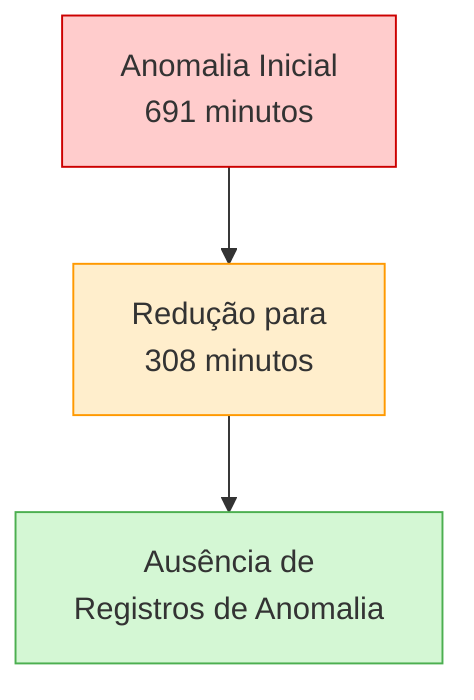

**Observações importantes:**
- Significativo tempo em anomalia de vibração no início do período (691 minutos)
- Redução para 308 minutos no relatório seguinte acompanhado de reducao de horas de funcionamento
- Ausência de registros de anomalia nos relatórios posteriores, uma vez que o ultimo registro de operacao foi no inicio de marco

Conforme documentado no relatório de 24/02/2025: *"Anomalia_Vibração_Turbina (TG2) – 691 minutos: Apesar de não ultrapassar limites críticos, sugere atenção a rotações específicas ou condições de carga que elevem vibração."*

### 4.4 Deslocamento Axial do Eixo

**Tabela 6: Deslocamento Axial do Eixo (mm)**

| Data | Deslocamento (mm) | Variação | % do Limite H (0,10) |
|------|------------------|----------|----------------------|
| 24/02/2025 | -0,10 | Linha base | 100% |
| 03/03/2025 | -0,09 | +0,01 | 90% |
| 10/03/2025 | -0,09 | +0,00 | 90% |
| 17/03/2025 | -0,08 | +0,01 | 80% |
| 24/03/2025 | -0,076 | +0,004 | 76% |

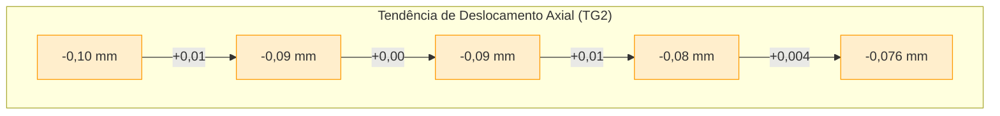

**Análise:**
- Tendência de redução progressiva no valor negativo do deslocamento axial
- Esta alteração, embora sutil, pode indicar mudanças no comportamento dinâmico do eixo
- O limite de alarme alto (H) é 0,10 mm, portanto o deslocamento ainda está dentro dos limites aceitáveis, porém a tendência é significativa

---

## 5. Análise Comparativa com Outros Turbogeradores

### 5.1 Vibração do Rotor da Turbina

**Tabela 7: Vibração do Rotor da Turbina - Comparação entre TGs**

| Data | TG1 | TG2 | TG4 | Limite H |
|------|-----|-----|-----|----------|
| 24/02/2025 | 11,03 | 14,20 | 20,79 | 19,05 |
| 03/03/2025 | 10,99 | 16,29 | 20,60 | 19,05 |
| 10/03/2025 | 10,93 | 16,48 | 20,59 | 19,05 |
| 17/03/2025 | 10,89 | 16,59 | 20,68 | 19,05 |
| 24/03/2025 | 10,89 | 16,70 | 20,79 | 19,05 |
| **Tendência** | **Estável** | **↑ 17,6%** | **Estável** | - |

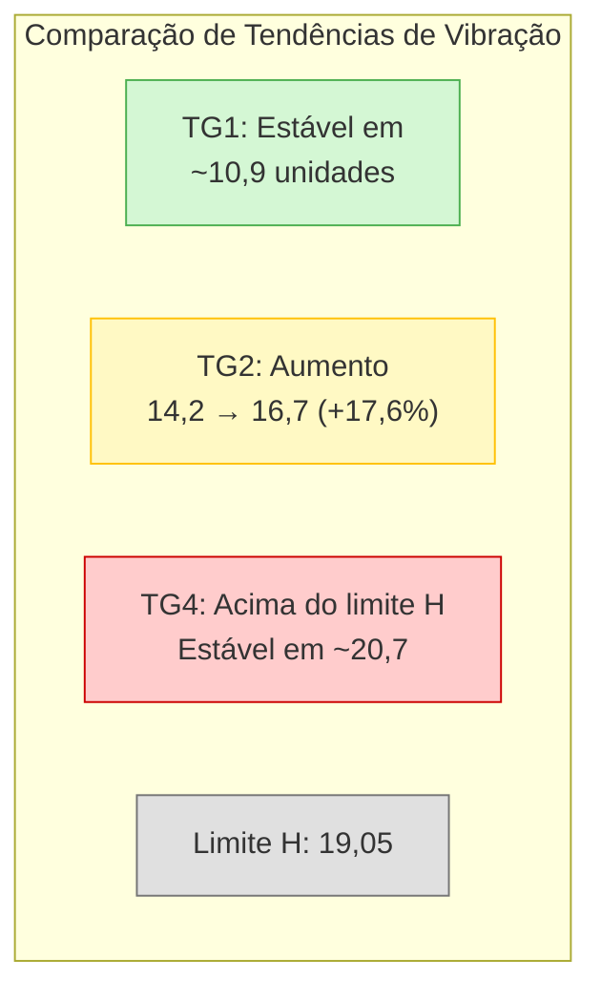

**Observações críticas:**
- Enquanto TG1 e TG4 mantêm valores de vibração relativamente estáveis, o TG2 apresenta tendência consistente de aumento
- O TG4 opera com valores acima do limite H (19,05), porém estáveis
- O TG2 está em trajetória de aproximação ao limite H, com aumento de 17,6% em 30 dias

### 5.2 Temperatura de Entrada na Turbina

**Tabela 8: Temperatura de Entrada na Turbina (°C) - Comparação entre TGs**

| Data | TG1 | TG2 | TG4 |
|------|-----|-----|-----|
| 24/02/2025 | 1232,86 | 1190,91 | 1228,09 |
| 03/03/2025 | 1215,89 | 1244,52 | 1222,34 |
| 10/03/2025 | 1210,98 | 1242,78 | 1207,43 |
| 17/03/2025 | 1248,41 | 1242,75 | 1206,87 |
| 24/03/2025 | 1253,29 | 1240,39 | 1209,44 |
| **Variação** | **+20,43** | **+49,48** | **-18,65** |

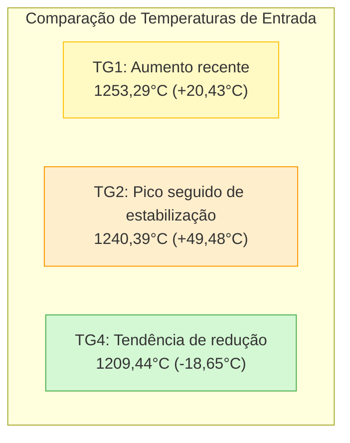

**Análise:**
- O TG2 iniciou o período com a menor temperatura, mas apresentou aumento significativo, mantendo-se posteriormente em patamar elevado
- Nos relatórios mais recentes, a temperatura do TG2 permanece elevada, mas abaixo do TG1
- Importante notar que mesmo o maior valor (1253,29°C) está significativamente abaixo do limite de alarme (1549°C)

---

## 6. Sinais Precoces de Problemas nas Pás da Turbina

Com base na análise completa dos dados, podemos identificar os seguintes sinais precoces que podem estar relacionados a problemas nas pás da turbina do TG2:

### 6.1 Comportamento Anômalo de Vibrações

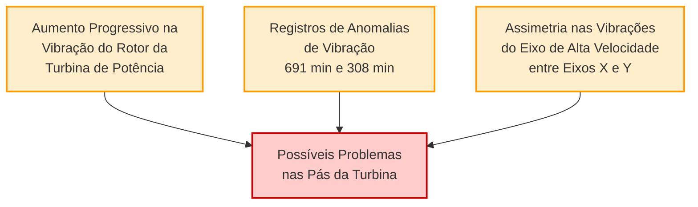

**Evidências documentadas:**
- No relatório de 24/02/2025: *"Anomalia_Vibração_Turbina (TG2) – 691 minutos: Apesar de não ultrapassar limites críticos, sugere atenção a rotações específicas ou condições de carga que elevem vibração."*
- No relatório de 10/03/2025: *"O 'Gearbox_high_speed_shaft_journal_brg_Y' apresenta valor médio de 15,15 μm, aproximadamente o dobro do eixo X equivalente (7,33 μm). Esta assimetria nas vibrações pode indicar desalinhamento progressivo ou desgaste diferencial no mancal."*
- Aumento de 17,6% na vibração do rotor da turbina de potência em 30 dias

### 6.2 Alterações nos Parâmetros Térmicos

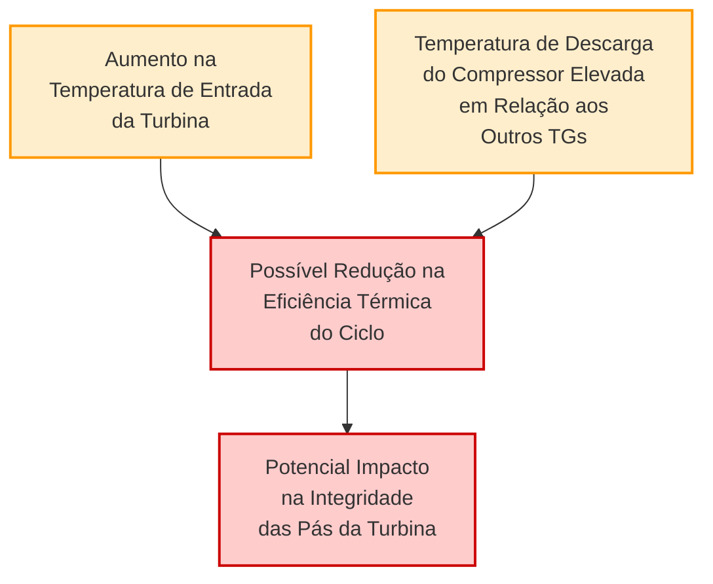

**Evidências documentadas:**
- No relatório de 10/03/2025: *"TG2 opera com temperatura média mais elevada (1.242,78°C) em comparação ao TG1 (1.210,98°C) e TG4 (1.207,43°C). Embora todos estejam abaixo do limite de alarme alto (1.549°C), o TG2 apresenta cerca de 35°C acima dos outros."*
- No relatório de 17/03/2025: *"Temperatura de descarga do compressor (T3A): Mantém-se consistentemente mais alta que nos demais TGs (média de 385,9°C), com leve tendência de aumento (~2°C) ao longo dos últimos 5 eventos registrados, indicando possível redução gradual na eficiência de compressão."*
- No relatório de 24/03/2025: *"O TG2 apresenta as temperaturas mais elevadas, o que pode indicar maior carga ou menor eficiência do compressor, apesar de ter operado menos horas que os outros TGs."*

### 6.3 Evidências Operacionais

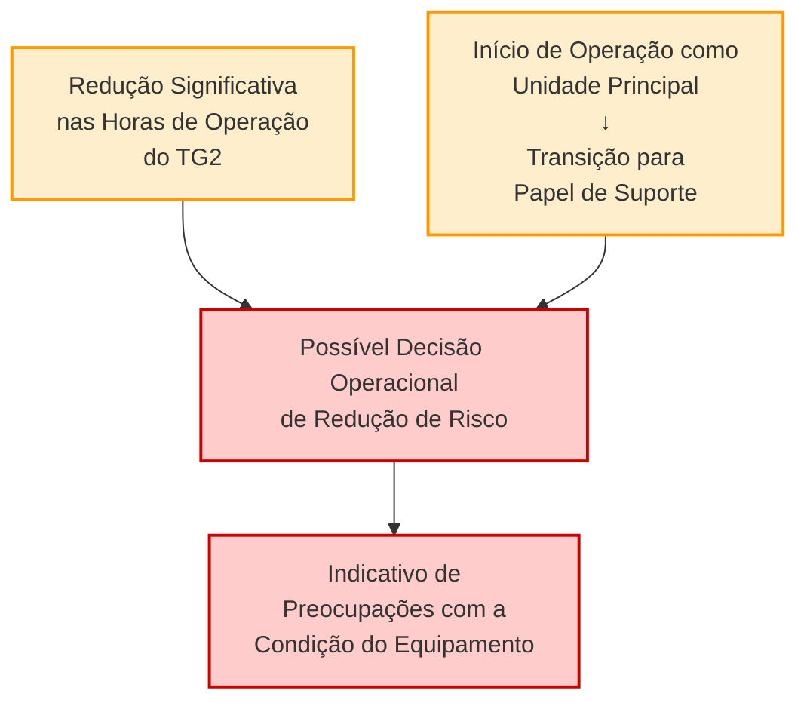

**Evidências documentadas:**
- Redução das horas de operação do TG2 de 694h para 405h no período analisado
- No relatório de 24/03/2025: *"TG2: Com o menor tempo de operação entre os três TGs (405 horas), apresenta características operacionais que sugerem um papel de suporte ou complemento aos outros geradores."*

---

## 7. Correlação dos Eventos e Linha do Tempo

A análise cronológica dos eventos permite identificar a evolução dos problemas no TG2:

**Tabela 9: Linha do Tempo de Eventos e Sinais Relevantes - TG2**

| Data | Evento/Sinal | Observação |
|------|-------------|------------|
| 24/02/2025 | Anomalia_Vibração_Turbina (691 min) | Primeiro alerta documentado sobre vibrações |
| 24/02/2025 | Vibração do rotor: 14,20 unidades | Valor inicial, já elevado em relação ao TG1 |
| 24/02/2025-03/03/2025 | Aumento da temperatura de entrada: 1190→1244°C | Aumento abrupto de 53,61°C |
| 24/02/2025-03/03/2025 | Aumento da temperatura de descarga: 361→386°C | Aumento significativo de 25,30°C |
| 03/03/2025 | Anomalia_Vibração_Turbina (308 min) | Redução no tempo de anomalia, mas ainda presente |
| 03/03/2025 | Vibração do rotor: 16,29 unidades | Aumento de 2,09 unidades em uma semana |
| 03/03/2025 | Alerta sobre comportamento da vibração | Documentado no relatório: "requer monitoramento contínuo" |
| 03/03/2025-10/03/2025 | Aumento das horas de operação: 626→694h | Ainda utilizado como unidade principal |
| 10/03/2025 | Documentação da temperatura elevada | Relatório menciona operação 35°C acima dos outros TGs |
| 10/03/2025 | Alerta sobre assimetria nas vibrações | Identificada diferença entre eixos X e Y |
| 10/03/2025-17/03/2025 | Redução das horas de operação: 694→558h | Início da diminuição do uso do TG2 |
| 17/03/2025 | Alerta sobre temperatura do compressor | Relatório menciona "possível redução na eficiência" |
| 17/03/2025-24/03/2025 | Redução adicional: 558→405h | TG2 passa a ser a unidade menos utilizada |
| 24/03/2025 | Confirmação do padrão de temperatura elevada | "apesar de ter operado menos horas que os outros TGs" |
| 24/03/2025 | Vibração do rotor: 16,70 unidades | 87,7% do limite de alarme alto (19,05) |

A linha do tempo acima evidencia a correlação entre os eventos detectados e a progressão dos sintomas associados a potenciais problemas nas pás da turbina. É notável que os primeiros sinais foram detectados já no relatório de 24/02/2025, com alertas progressivos em todos os relatórios subsequentes.

---

## 8. Conclusões e Considerações Finais

### 8.1 Principais Conclusões

1. **Presença de Múltiplos Sinais Precoces**: A análise identificou diversos indicadores consistentes que corroboram as preocupações relatadas pelos operadores sobre possíveis problemas nas pás da turbina do TG2:
   - Aumento progressivo e consistente nas vibrações do rotor da turbina
   - Elevação e manutenção de temperaturas operacionais acima dos demais TGs
   - Registros de anomalias de vibração nos estágios iniciais
   - Alterações no padrão de uso operacional do equipamento

2. **Progressão Temporal dos Sintomas**: Os dados demonstram uma evolução gradual dos sintomas ao longo do período analisado, com sinais presentes desde o primeiro relatório (24/02/2025) e evolução documentada em todos os relatórios subsequentes.

3. **Diferenciação em Relação aos Outros TGs**: O comportamento dos parâmetros do TG2 mostra desvios significativos quando comparado aos TG1 e TG4, especialmente no que se refere ao padrão de aumento de vibrações.

4. **Indícios de Resposta Operacional**: A redução significativa nas horas de operação do TG2 (de 694h para 405h) sugere uma possível decisão operacional de mitigação de riscos, reforçando a percepção de problemas potenciais.

### 8.2 Implicações dos Achados

Os sinais identificados, embora ainda não tenham atingido níveis críticos que exijam parada imediata, apresentam tendências preocupantes que justificam a intervenção de manutenção programada. A progressão contínua dos sintomas, especialmente o aumento nas vibrações, é consistente com problemas nas pás da turbina como:

- Desgaste progressivo nas pás
- Depósitos ou incrustações
- Danos iniciais ou micro-trincas
- Desequilíbrio aerodinâmico

### 8.3 Confirmação dos Alertas Prévios

Esta análise confirma que os sinais precoces de problemas foram devidamente identificados e reportados nos relatórios anteriores, com alertas específicos em cada relatório:

1. **Relatório de 24/02/2025**: Primeiro alerta sobre anomalias de vibração (691 minutos)
2. **Relatório de 03/03/2025**: Alerta sobre comportamento da vibração do rotor da turbina
3. **Relatório de 10/03/2025**: Documentação da temperatura elevada e assimetria nas vibrações
4. **Relatório de 17/03/2025**: Alerta sobre temperatura de descarga do compressor consistentemente elevada
5. **Relatório de 24/03/2025**: Confirmação de temperaturas elevadas apesar da redução de horas operacionais

---

## 9. Considerações Finais

A análise detalhada dos dados operacionais do TG2 fornece evidências consistentes que corroboram as preocupações relatadas pelos operadores sobre possíveis problemas nas pás da turbina. Os sinais precoces foram adequadamente documentados em relatórios anteriores, e a progressão dos sintomas ao longo do tempo reforça a necessidade da manutenção programada.

A combinação de aumento nas vibrações, temperaturas operacionais elevadas e alterações no padrão de uso sugere a existência de condições que podem comprometer a integridade e o desempenho das pás da turbina no médio prazo, se não forem adequadamente tratadas durante a parada programada.

---

*Este relatório foi elaborado com base na análise dos dados operacionais disponíveis, visando identificar padrões e tendências que possam indicar problemas potenciais nas pás da turbina do TG2. As conclusões apresentadas são fundamentadas em evidências técnicas e na progressão temporal dos parâmetros monitorados.*
