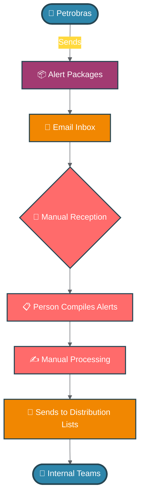
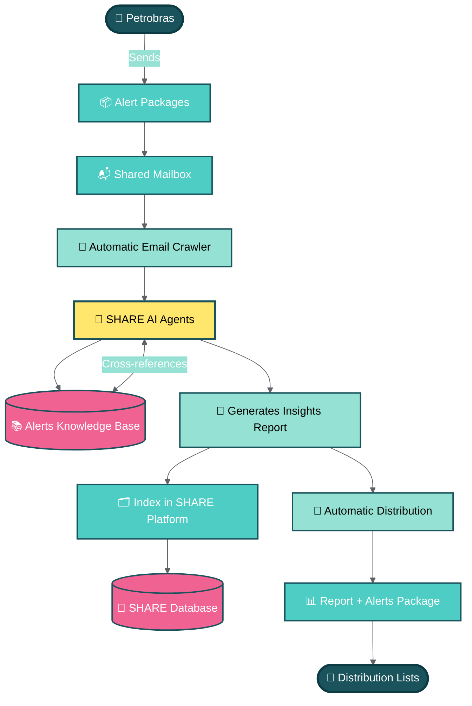

# 📊 SHARE Platform - Process Flow Diagrams

## 🚨 Safety Alert Management System for Offshore Drilling Contractors

---

### 📧 Current Process - Manual Alert Distribution

---

### 🚀 SHARE Process - Automated AI-Powered Distribution

---

## 🎯 Key Benefits of SHARE Automation

| **Current Process** 🔴 | **SHARE Process** 🟢 |
|------------------------|---------------------|
| ⏱️ Manual time-consuming tasks | ⚡ Instant automated processing |
| 👤 Human dependency | 🤖 24/7 AI-powered operation |
| 📋 Simple compilation | 🧠 Intelligent insights generation |
| 🗂️ No systematic indexing | 💾 Automatic database indexing |
| ❌ Risk of human error | ✅ Consistent accuracy |
| 📧 Basic email forwarding | 📊 Enriched reports with insights |

---

### 💡 Process Transformation Summary

The **SHARE platform** revolutionizes safety alert management by:

- 🔄 **Automating** the entire workflow from reception to distribution
- 🤖 **Leveraging AI** to provide contextual insights and cross-references
- 📈 **Creating value** through intelligent report generation
- 🗃️ **Building knowledge** with systematic indexing and database storage
- ⏰ **Saving time** by eliminating manual processing steps
- 🎯 **Ensuring consistency** in alert distribution and management

---

*Built for the future of offshore drilling safety management* 🌊⚓
