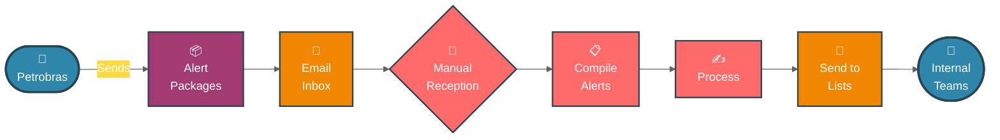
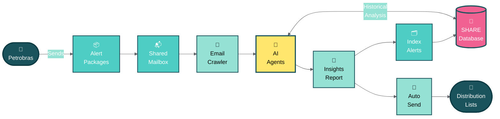
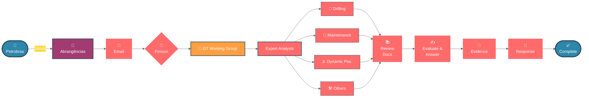
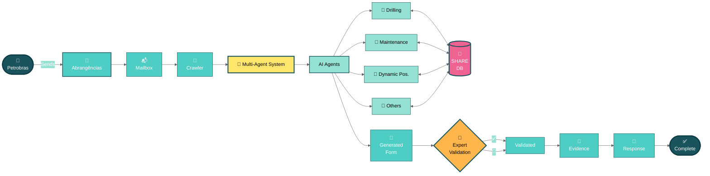
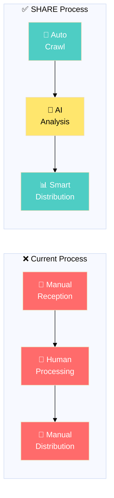
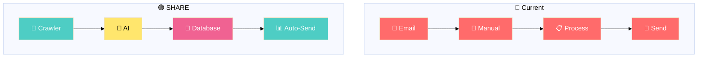
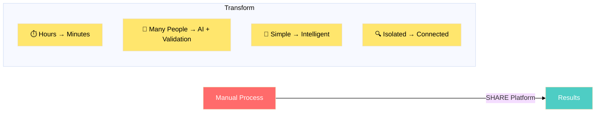

# 📊 SHARE Platform - Process Flow Diagrams

## 🚨 Safety Alert Management System for Offshore Drilling Contractors

---

### 📧 Process 1: Alert Distribution

#### Current Process - Manual Alert Distribution

#### SHARE Process - Automated AI-Powered Distribution

---

### 📋 Process 2: Abrangências Management

#### Current Process - Manual Abrangências Evaluation

#### SHARE Process - AI-Powered Multi-Agent Evaluation

---

### 🎯 Compact Comparison View

---

## 📊 Alternative Vertical Layout (Split View)

If you need to show both processes side by side in a slide, you can use this split layout:

---

## 🎯 Key Benefits Summary (Slide-Friendly)

| **Metric** | **Current** 🔴 | **SHARE** 🟢 | **Improvement** |
|------------|---------------|--------------|-----------------|
| **Processing Time** | 2-4 hours | 5-10 minutes | **95% faster** ⚡ |
| **Human Effort** | 100% manual | 20% validation only | **80% reduction** 📉 |
| **Error Rate** | Variable | Consistent | **Near zero** ✅ |
| **Insights** | Basic | AI-enriched | **10x more value** 📊 |
| **Availability** | Business hours | 24/7 | **Always on** 🔄 |

---

### 💡 Quick Impact Visual

---

*Built for the future of offshore drilling safety management* 🌊⚓
