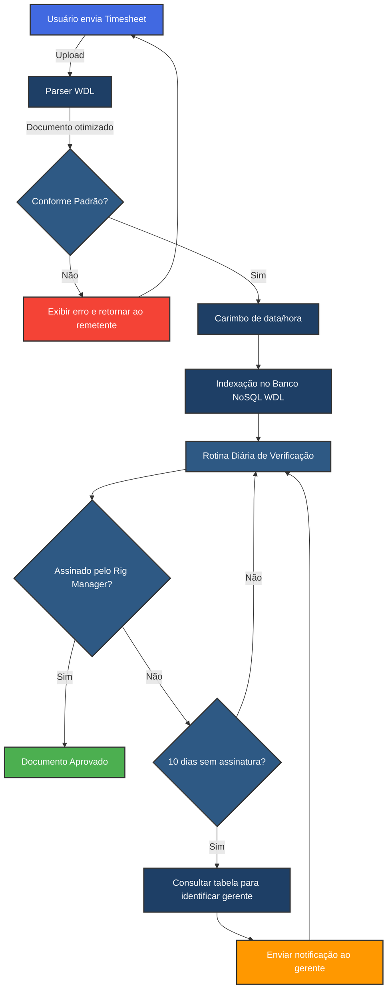
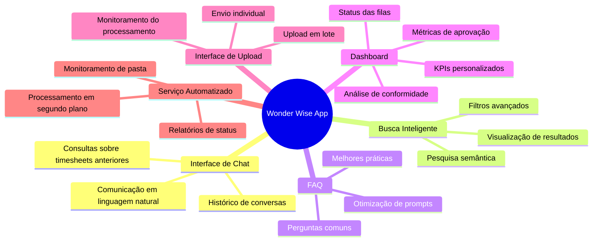

# Wonder Wise: Solução de Automação para Gestão de Timesheets

  

## 🚀 Apresentação

A **Wonder Data Labs (WDL)** tem o prazer de apresentar o **Wonder Wise**, nossa plataforma de IA industrial projetada para revolucionar o processamento de timesheets da sua empresa. Nossa solução combina tecnologia de ponta em processamento de documentos, inteligência artificial e automação de fluxos de trabalho para eliminar gargalos administrativos e garantir conformidade com seus padrões corporativos.

## 💡 Visão Geral da Solução

O Wonder Wise foi configurado especificamente para entender, processar e gerenciar timesheets conforme os padrões da sua empresa, automatizando verificações de conformidade e monitorando aprovações pendentes de gestores.

## 🔄 Fluxo de Processamento de Timesheets

## 📱 Interface da Aplicação Wonder Wise

## 🛠️ Componentes da Solução

<table>
  <tr>
    <td width="50%" style="padding: 20px; background-color: #EBF5FB; border-radius: 8px;">
      <h3 style="color: #1E3F66; border-bottom: 2px solid #4169E1; padding-bottom: 10px;">🤖 Parser WDL</h3>
      
Nossa tecnologia proprietária converte documentos em formato otimizado para processamento por IA, preservando a estrutura e o significado dos dados.

    </td>
    <td width="50%" style="padding: 20px; background-color: #EBF5FB; border-radius: 8px;">
      <h3 style="color: #1E3F66; border-bottom: 2px solid #4169E1; padding-bottom: 10px;">💾 Banco de Dados NoSQL</h3>
      
Armazenamento otimizado para IA que permite consultas semânticas, indexação de documentos e recuperação ultrarrápida de informações.

    </td>
  </tr>
  <tr>
    <td width="50%" style="padding: 20px; background-color: #EBF5FB; border-radius: 8px;">
      <h3 style="color: #1E3F66; border-bottom: 2px solid #4169E1; padding-bottom: 10px;">⚙️ Motor de Automação</h3>
      
Gerencia fluxos de trabalho, cronogramas e notificações automaticamente, garantindo que todos os prazos sejam cumpridos.

    </td>
    <td width="50%" style="padding: 20px; background-color: #EBF5FB; border-radius: 8px;">
      <h3 style="color: #1E3F66; border-bottom: 2px solid #4169E1; padding-bottom: 10px;">📊 Análise de Dados</h3>
      
Transforme dados de timesheets em insights acionáveis com nossa camada de análise inteligente e dashboards personalizáveis.

    </td>
  </tr>
</table>

## 📋 Requisitos para Implementação

Para uma implementação bem-sucedida do Wonder Wise em seu ambiente, precisaremos:

1. **Documentação de Critérios de Aceitação:**
   - Especificações detalhadas dos padrões de timesheet
   - Regras de validação e conformidade
   - Exemplos de documentos válidos e inválidos

2. **Tabela de Referência de Gerentes:**
   - Mapeamento entre projetos/equipes e seus respectivos Rig Managers
   - Informações de contato para notificações (e-mail, telefone)
   - Hierarquia de escalação quando necessário

3. **Fonte de Verificação de Assinaturas:**
   - API ou endpoint para verificação de status de assinatura
   - Formato de assinatura aceito (digital, física digitalizada)
   - Procedimentos de autenticação e verificação

## 💼 Benefícios Empresariais

- **Redução de 85% no tempo de processamento** de timesheets
- **Conformidade garantida** com padrões e regulamentos
- **Eliminação de atrasos** nas aprovações de gerentes
- **Visibilidade completa** do status de cada documento
- **Acesso instantâneo** ao histórico de timesheets
- **Insights valiosos** sobre padrões de trabalho e produtividade

## 🔍 Próximos Passos

1. **Reunião de Definição de Escopo** para alinhamento detalhado
2. **Configuração de Ambiente de Teste** para validação de conceito
3. **Integração com Sistemas Existentes** da sua empresa
4. **Treinamento de Usuários** e gestores
5. **Implementação Gradual** com monitoramento de desempenho

---

  <h3>Simplifique seus processos industriais com Wonder Wise!</h3>
  
<strong>Wonder Data Labs</strong> - Industrial AI, Simplified

  

