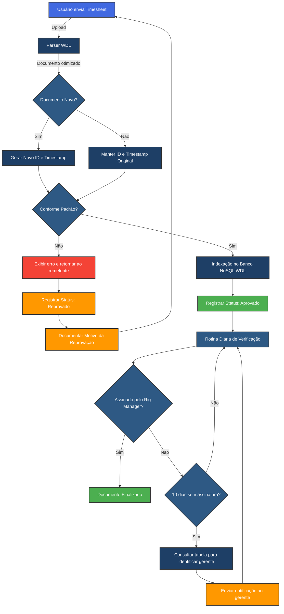
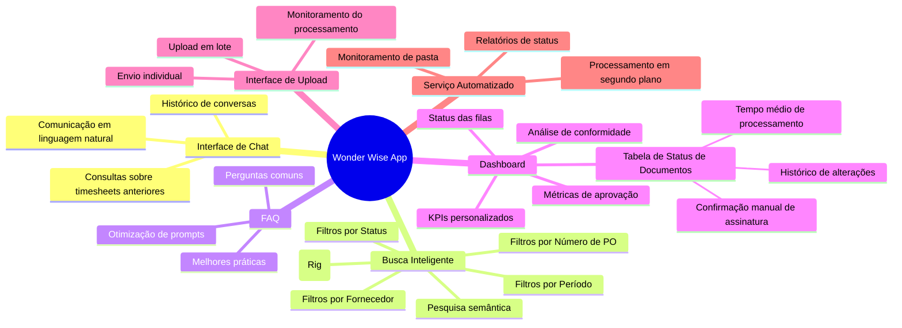
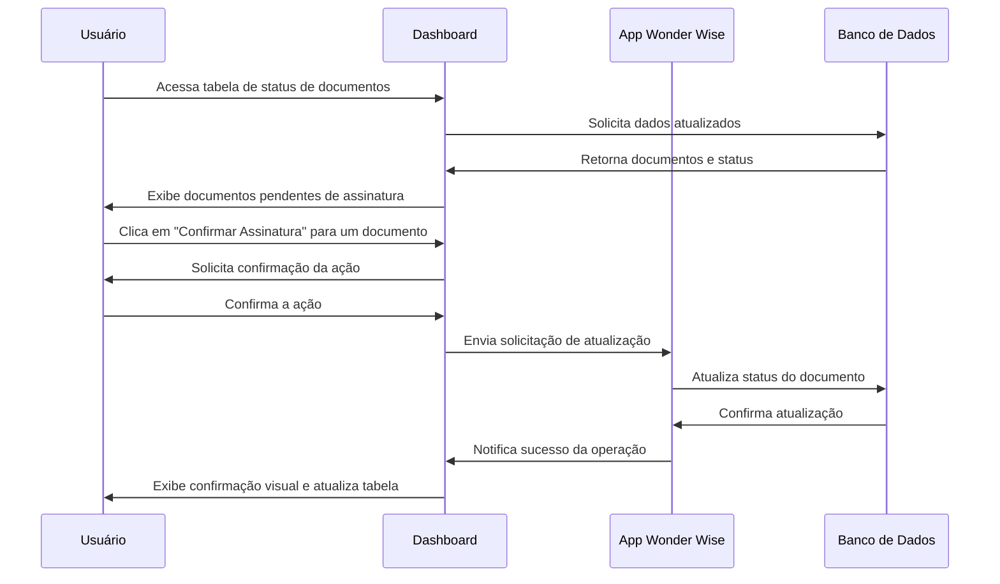

# Wonder Wise: Solução de Automação para Gestão de Timesheets

  

## 🚀 Apresentação

A **Wonder Data Labs (WDL)** tem o prazer de apresentar o **Wonder Wise**, nossa plataforma de IA industrial projetada para revolucionar o processamento de timesheets da sua empresa. Nossa solução combina tecnologia de ponta em processamento de documentos, inteligência artificial e automação de fluxos de trabalho para eliminar gargalos administrativos e garantir conformidade com seus padrões corporativos.

## 💡 Visão Geral da Solução

O Wonder Wise foi configurado especificamente para entender, processar e gerenciar timesheets conforme os padrões da sua empresa, automatizando verificações de conformidade e monitorando aprovações pendentes de gestores.

## 🔄 Fluxo de Processamento de Timesheets

```mermaid
flowchart TD
    A[Usuário envia Timesheet] -->|Upload| B[Parser WDL]
    B -->|Documento otimizado| C{Documento Novo?}
    C -->|Sim| D[Gerar Novo ID e Timestamp]
    C -->|Não| E[Manter ID e Timestamp Original]
    D --> F{Conforme Padrão?}
    E --> F
    F -->|Não| G[Exibir erro e retornar ao remetente]
    G --> H[Registrar Status: Reprovado]
    H --> I[Documentar Motivo da Reprovação]
    I --> A
    F -->|Sim| J[Indexação no Banco NoSQL WDL]
    J --> K[Registrar Status: Aprovado]
    K --> L[Rotina Diária de Verificação]
    L --> M{Assinado pelo Rig Manager?}
    M -->|Sim| N[Documento Finalizado]
    M -->|Não| O{10 dias sem assinatura?}
    O -->|Não| L
    O -->|Sim| P[Consultar tabela para identificar gerente]
    P --> Q[Enviar notificação ao gerente]
    Q --> L
    
    style A fill:#4169E1,stroke:#333,stroke-width:2px,color:white
    style B fill:#1E3F66,stroke:#333,stroke-width:2px,color:white
    style C fill:#2E5984,stroke:#333,stroke-width:2px,color:white
    style D fill:#1E3F66,stroke:#333,stroke-width:2px,color:white
    style E fill:#1E3F66,stroke:#333,stroke-width:2px,color:white
    style F fill:#2E5984,stroke:#333,stroke-width:2px,color:white
    style G fill:#F44336,stroke:#333,stroke-width:2px,color:white
    style H fill:#FF9800,stroke:#333,stroke-width:2px,color:white
    style I fill:#FF9800,stroke:#333,stroke-width:2px,color:white
    style J fill:#1E3F66,stroke:#333,stroke-width:2px,color:white
    style K fill:#4CAF50,stroke:#333,stroke-width:2px,color:white
    style L fill:#2E5984,stroke:#333,stroke-width:2px,color:white
    style M fill:#2E5984,stroke:#333,stroke-width:2px,color:white
    style N fill:#4CAF50,stroke:#333,stroke-width:2px,color:white
    style O fill:#2E5984,stroke:#333,stroke-width:2px,color:white
    style P fill:#1E3F66,stroke:#333,stroke-width:2px,color:white
    style Q fill:#FF9800,stroke:#333,stroke-width:2px,color:white
```

## 📱 Interface da Aplicação Wonder Wise

```mermaid
mindmap
  root((Wonder Wise App))
    Interface de Chat
      Consultas sobre timesheets anteriores
      Comunicação em linguagem natural
      Histórico de conversas
    Busca Inteligente
      Filtros por Fornecedor
      Filtros por Sonda (Rig)
      Filtros por Número de PO
      Filtros por Status
      Pesquisa semântica
      Filtros por Período
    FAQ
      Perguntas comuns
      Otimização de prompts
      Melhores práticas
    Dashboard
      Análise de conformidade
      Métricas de aprovação
      Status das filas
      KPIs personalizados
      Tabela de Status de Documentos
        Confirmação manual de assinatura
        Histórico de alterações
        Tempo médio de processamento
    Interface de Upload
      Envio individual
      Upload em lote
      Monitoramento do processamento
    Serviço Automatizado
      Monitoramento de pasta
      Processamento em segundo plano
      Relatórios de status
```

## 🗃️ Funcionalidade de Dashboard com Gestão de Status

```mermaid
sequenceDiagram
    participant U as Usuário
    participant D as Dashboard
    participant A as App Wonder Wise
    participant B as Banco de Dados
    
    U->>D: Acessa tabela de status de documentos
    D->>B: Solicita dados atualizados
    B->>D: Retorna documentos e status
    D->>U: Exibe documentos pendentes de assinatura
    U->>D: Clica em "Confirmar Assinatura" para um documento
    D->>U: Solicita confirmação da ação
    U->>D: Confirma a ação
    D->>A: Envia solicitação de atualização
    A->>B: Atualiza status do documento
    B->>A: Confirma atualização
    A->>D: Notifica sucesso da operação
    D->>U: Exibe confirmação visual e atualiza tabela
```

## 🛠️ Componentes da Solução

<table>
  <tr>
    <td width="50%" style="padding: 20px; background-color: #EBF5FB; border-radius: 8px;">
      <h3 style="color: #1E3F66; border-bottom: 2px solid #4169E1; padding-bottom: 10px;">🤖 Parser WDL</h3>
      
Nossa tecnologia proprietária converte documentos em formato otimizado para processamento por IA, preservando a estrutura e o significado dos dados. Identifica automaticamente documentos novos versus revisões.

    </td>
    <td width="50%" style="padding: 20px; background-color: #EBF5FB; border-radius: 8px;">
      <h3 style="color: #1E3F66; border-bottom: 2px solid #4169E1; padding-bottom: 10px;">💾 Banco de Dados NoSQL</h3>
      
Armazenamento otimizado para IA que permite consultas semânticas, indexação de documentos e recuperação ultrarrápida de informações, mantendo histórico completo de todas as interações.

    </td>
  </tr>
  <tr>
    <td width="50%" style="padding: 20px; background-color: #EBF5FB; border-radius: 8px;">
      <h3 style="color: #1E3F66; border-bottom: 2px solid #4169E1; padding-bottom: 10px;">⚙️ Motor de Automação</h3>
      
Gerencia fluxos de trabalho, cronogramas e notificações automaticamente, garantindo que todos os prazos sejam cumpridos e mantendo registro de tempos de processamento.

    </td>
    <td width="50%" style="padding: 20px; background-color: #EBF5FB; border-radius: 8px;">
      <h3 style="color: #1E3F66; border-bottom: 2px solid #4169E1; padding-bottom: 10px;">📊 Análise de Dados</h3>
      
Transforme dados de timesheets em insights acionáveis com nossa camada de análise inteligente e dashboards personalizáveis, permitindo visualização detalhada por fornecedor, sonda e PO.

    </td>
  </tr>
</table>

## 📋 Requisitos para Implementação

Para uma implementação bem-sucedida do Wonder Wise em seu ambiente, precisaremos:

1. **Documentação de Critérios de Aceitação:**
   - Especificações detalhadas dos padrões de timesheet
   - Regras de validação e conformidade
   - Exemplos de documentos válidos e inválidos

2. **Tabela de Referência de Gerentes:**
   - Mapeamento entre projetos/equipes e seus respectivos Rig Managers
   - Informações de contato para notificações (e-mail, telefone)
   - Hierarquia de escalação quando necessário

3. **Fonte de Verificação de Assinaturas:**
   - API ou endpoint para verificação de status de assinatura
   - Formato de assinatura aceito (digital, física digitalizada)
   - Procedimentos de autenticação e verificação

## 💼 Benefícios Empresariais

- **Redução de 85% no tempo de processamento** de timesheets
- **Conformidade garantida** com padrões e regulamentos
- **Eliminação de atrasos** nas aprovações de gerentes
- **Visibilidade completa** do status de cada documento
- **Acesso instantâneo** ao histórico de timesheets
- **Insights valiosos** sobre padrões de trabalho e produtividade
- **Rastreabilidade total** de documentos reprovados e resubmetidos
- **Análise de gargalos** em processos de aprovação

## 🔍 Diferenciais da Busca Inteligente

Nossa solução de busca avançada permite segmentação e filtragem por múltiplos critérios:

- **Por Fornecedor:** Visualize apenas timesheets de determinados prestadores de serviço
- **Por Sonda (Rig):** Filtre documentos relacionados a equipamentos específicos
- **Por Número de PO:** Acompanhe documentos vinculados a ordens de compra específicas
- **Por Status:** Identifique rapidamente documentos pendentes, aprovados ou rejeitados
- **Por Período:** Análise temporal para identificar tendências e padrões
- **Busca Semântica:** Encontre documentos mesmo sem saber os termos exatos

## 🔄 Próximos Passos

1. **Reunião de Definição de Escopo** para alinhamento detalhado
2. **Configuração de Ambiente de Teste** para validação de conceito
3. **Integração com Sistemas Existentes** da sua empresa
4. **Treinamento de Usuários** e gestores
5. **Implementação Gradual** com monitoramento de desempenho

---

  <h3>Simplifique seus processos industriais com Wonder Wise!</h3>
  
<strong>Wonder Data Labs</strong> - Industrial AI, Simplified

  

