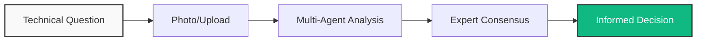
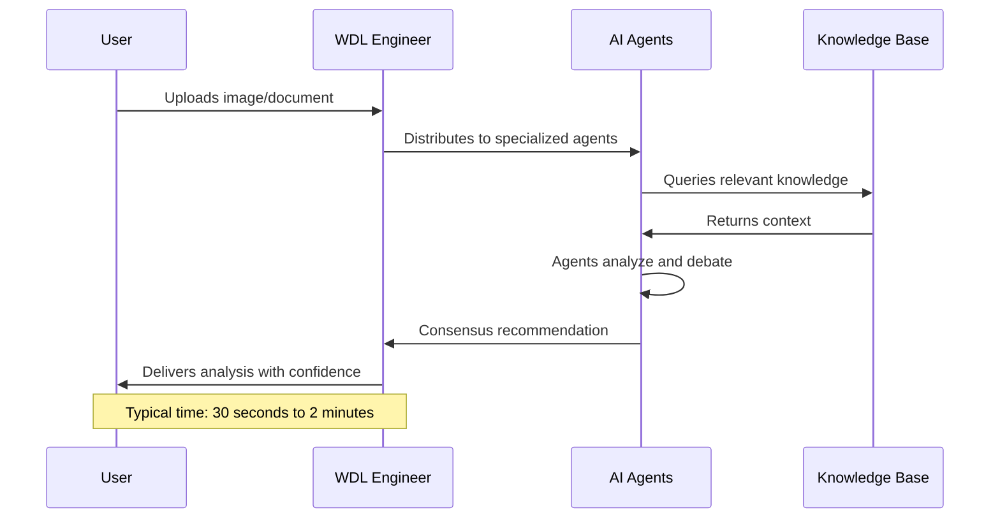
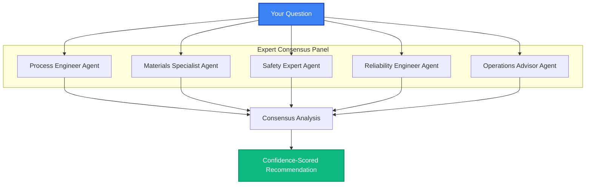
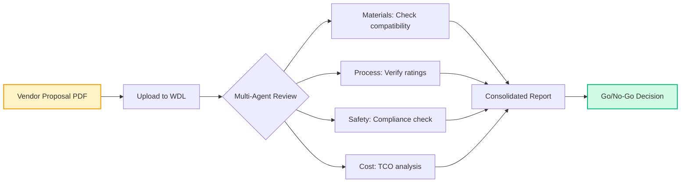
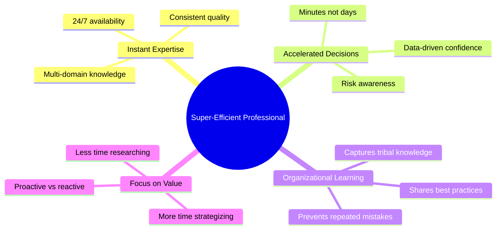
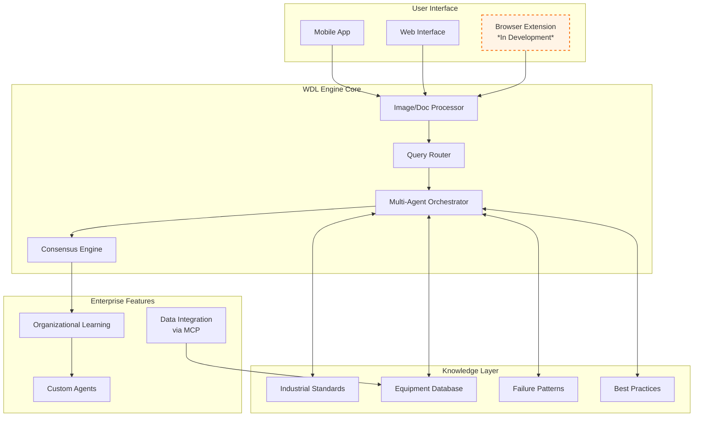
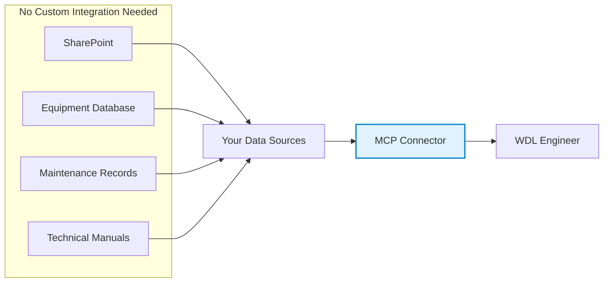

# WDL Engineer: Technical Overview & Efficiency Opportunities

<div align="center">
  
  
  **Transforming Industrial Decision-Making Through Multi-Agent AI**
  
  [How It Works](#how-it-works) • [Use Cases](#real-world-use-cases) • [Efficiency Gains](#efficiency-opportunities) • [Architecture](#technical-architecture) • [Deployment](#deployment-approach)
</div>

---

## 📋 Table of Contents

1. [Executive Summary](#executive-summary)
2. [How WDL Engineer Works](#how-it-works)
3. [The Multi-Agent Advantage](#the-multi-agent-advantage)
4. [Real-World Use Cases](#real-world-use-cases)
5. [Efficiency Opportunities](#efficiency-opportunities)
6. [Technical Architecture](#technical-architecture)
7. [Integration Capabilities](#integration-capabilities)
8. [Deployment Approach](#deployment-approach)
9. [Current Capabilities & Roadmap](#current-capabilities--roadmap)

---

## Executive Summary

WDL Engineer is an industrial AI assistant that helps technical professionals make faster, more informed decisions by providing instant access to multi-domain expertise. Rather than waiting hours or days for specialist input, users can photograph or upload technical documents to receive immediate, consensus-based analysis.

### 🎯 Key Value Propositions



- **Time Reduction**: Technical decisions from days to minutes
- **Expertise Access**: Multiple specialist perspectives instantly available
- **Knowledge Preservation**: Organizational learning from every interaction
- **Risk Mitigation**: Consensus-based recommendations with confidence scoring

---

## How It Works

### 🔄 The Core Process

<div align="center">



</div>

### 📸 What You Can Analyze

| Input Type | Examples | Typical Analysis Time |
|------------|----------|----------------------|
| **P&IDs** | Process flow diagrams, instrumentation layouts | 30-60 seconds |
| **Specifications** | Vendor sheets, material specs, equipment data | 45-90 seconds |
| **Dashboards** | SCADA screens, control panels, HMI displays | 30-45 seconds |
| **Equipment Photos** | Nameplates (when visible), damage, installations | 60-120 seconds |
| **Technical Documents** | Procedures, manuals, reports | 60-90 seconds |

> ⚠️ **Note**: Equipment identification from field photos requires visible nameplates or tags. Full specification retrieval requires integration with equipment databases.

---

## The Multi-Agent Advantage

### 🤖 Specialized Agent Roles

<div align="center">



</div>

### 💡 Why Multiple Agents Matter

Traditional single-AI responses provide one perspective. WDL Engineer's multi-agent approach mimics real-world expert consultation:

| Single AI Response | Multi-Agent Consensus |
|-------------------|----------------------|
| "This valve appears suitable" | **Process**: "Flow characteristics match"<br>**Materials**: "Concerned about chloride exposure"<br>**Safety**: "Requires double block and bleed"<br>**Reliability**: "Similar failed after 6 months"<br>**Consensus**: "Not recommended - 78% confidence" |

---

## Real-World Use Cases

### 🏭 Supply Chain Engineering

<details>
<summary><b>Vendor Specification Verification</b> (Click to expand)</summary>



**Actual Time Saved**: 2-3 days → 5 minutes
</details>

<details>
<summary><b>Emergency Replacement Sourcing</b> (Click to expand)</summary>

**Scenario**: Critical pump seal failure at 2 AM

**Traditional Approach**:
- Wait for morning (6 hours)
- Contact OEM (2 hours)
- Verify alternatives (4 hours)
- Total: 12+ hours of downtime

**With WDL Engineer**:
- Photo of damaged seal
- Immediate material and dimension analysis
- Compatible alternatives identified
- Cross-reference with inventory
- Total: 5 minutes to decision
</details>

### 🔧 Operations Support

<details>
<summary><b>Control Room Anomaly Analysis</b> (Click to expand)</summary>

```python
# Example interaction flow
User: *Screenshots unusual DCS trend*

WDL Response (30 seconds):
├── Process Agent: "Temperature spike indicates possible fouling"
├── Operations Agent: "Similar pattern preceded exchanger failure at Unit 2"
├── Safety Agent: "Current conditions within safe limits"
├── Reliability Agent: "Recommend inspection within 48 hours"
└── Consensus: "Non-critical but trending toward intervention"
    └── Confidence: 82%
    └── Recommended actions provided
```
</details>

### 🛠️ Maintenance Planning

<details>
<summary><b>Shift Handover Automation</b> (Click to expand)</summary>

The Shift Report Generator aggregates all interactions during a shift:

```markdown
## Automated Shift Report - Night Shift 06/15/2025

### Issues Analyzed: 7
- Compressor K-101 vibration (Critical - addressed)
- Heat exchanger E-205 approach temperature (Monitoring)
- Valve PV-302 passing (Scheduled for next PM)

### Time Saved: 4.5 hours
### Decisions Supported: 12
### Knowledge Captured: All interactions logged for future reference

[Click for detailed breakdown]
```

**Traditional shift report preparation**: 45-60 minutes  
**With WDL Engineer**: 2 minutes (one-click generation)
</details>

---

## Efficiency Opportunities

### 📊 Measurable Efficiency Gains

<div align="center">

| Activity | Traditional Time | With WDL Engineer | Efficiency Gain |
|----------|-----------------|-------------------|-----------------|
| Technical Verification | 4-6 hours | 2-5 minutes | **98% reduction** |
| Cross-Discipline Consultation | 1-3 days | 30 seconds | **99.9% reduction** |
| Shift Report Preparation | 45-60 minutes | 2 minutes | **96% reduction** |
| Emergency Troubleshooting | 2-4 hours | 5-10 minutes | **95% reduction** |
| Specification Comparison | 2-3 hours | 1-2 minutes | **98% reduction** |

</div>

### 🎯 Creating "Super-Efficient Professionals"



---

## Technical Architecture

### 🏗️ System Overview

<div align="center">



</div>

### 🔐 Data Security & Privacy

- **Complete Isolation**: Enterprise data never mixes with other customers
- **Audit Trail**: Every interaction logged with full traceability
- **Role-Based Access**: Configurable permissions by user type
- **Encryption**: Data encrypted at rest and in transit

---

## Integration Capabilities

### 🔌 Current Integration Options

| Method | Description | Implementation Time |
|--------|-------------|-------------------|
| **Direct Upload** | Manual photo/document upload | Immediate |
| **MCP Protocol** | Connect to data sources without APIs | 1-2 weeks |
| **Email Forward** | Forward documents for analysis | Available now |
| **Browser Extension** | Overlay on existing web systems | *In development* |

### 🌐 Model Context Protocol (MCP)

MCP enables secure connections to your existing systems without custom API development:



> 📌 **Note**: MCP is an open standard adopted by major AI providers (OpenAI, Anthropic, Google DeepMind), ensuring long-term compatibility.

---

## Current Capabilities & Roadmap

### ✅ Available Now

- Multi-agent consensus analysis
- Industry-specific agent profiles
- Shift report generation
- Time tracking and ROI measurement
- Basic document analysis
- Mobile and web access

### 🚧 In Development

- Browser extension for web system overlay
- Advanced equipment recognition
- Real-time dashboard monitoring
- Predictive failure alerts

### 🔮 Future Roadmap (Subject to Change)

- AR/VR integration for field support
- Voice-activated queries
- Automated work order generation
- Deep ERP integration

---

## 📈 Success Metrics

We recommend tracking:
- Time saved per user (automatically tracked)
- Number of decisions accelerated
- Cross-functional consultations replaced
- Knowledge capture rate
- User adoption and satisfaction

---

<div align="center">

**Questions?** Contact your Wonder DataLabs representative

*This document represents current capabilities as of June 2025. Features and timelines subject to change.*

</div>
