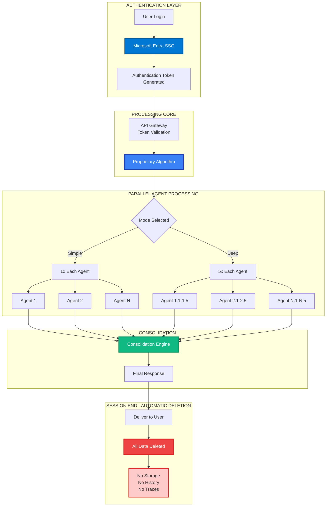
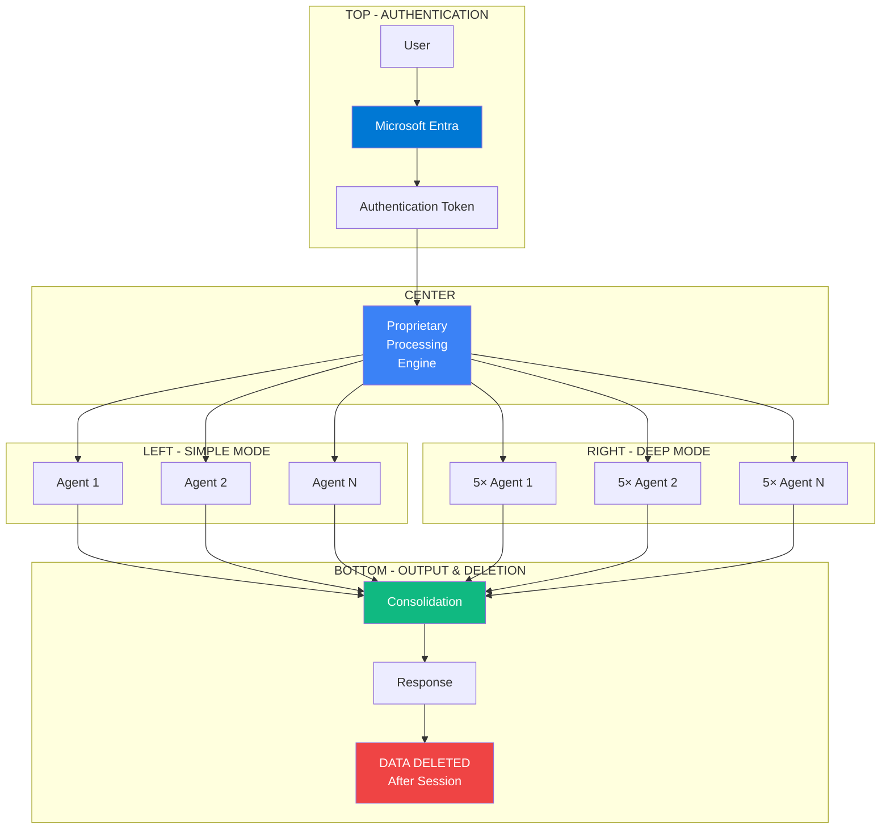
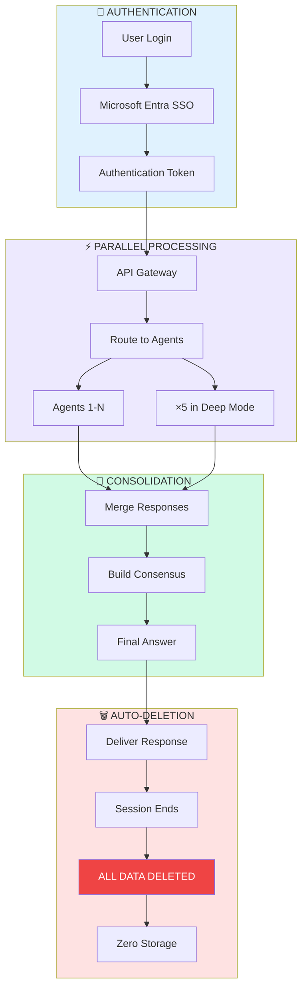

# WDL Engineer Data Processing Flow - Slide Content (Revised)

## Slide 15: Secure Data Processing Architecture

### Slide Content:
**Title:** How Your Query is Securely Processed

### Hub-and-Spoke Design for PowerPoint:



### Optimized Layered Design for PowerPoint:

```
+------------------------------------------------------------------+
|              How Your Query is Securely Processed                |
+------------------------------------------------------------------+
|                                                                  |
|  🔐 AUTHENTICATION        [Microsoft Entra SSO]                 |
|                           ↓ JWT Token ↓                         |
|                                                                  |
|  ⚡ API GATEWAY          [Validate & Route]                     |
|                           ↓ Authorized ↓                        |
|                                                                  |
|  🧠 PROCESSING ENGINE    [Proprietary Algorithm]                |
|                    ↙ Simple Mode    Deep Mode ↘                 |
|                                                                  |
|  🤖 PARALLEL AGENTS                                             |
|     Simple: [A1] [A2] [A3]    Deep: [A1×5] [A2×5] [A3×5]       |
|              ↓    ↓    ↓              ↓      ↓      ↓          |
|                                                                  |
|  🎯 CONSOLIDATION        [Consensus Engine]                     |
|                           ↓ Final Answer ↓                      |
|                                                                  |
|  📤 DELIVERY             [Encrypted Response to User]           |
|                                ↓                                |
|                                                                  |
|  🗑️ DATA DELETION        [SESSION ENDS = ALL DATA DELETED]     |
|                          • No Storage                           |
|                          • No History                           |
|                          • Complete Purge                       |
+------------------------------------------------------------------+
```

### Circular Flow Design (Alternative for Better Space Usage):



### Recommended PowerPoint Layout (2x3 Grid):

```
+------------------------------------------------------------------+
|          Secure Multi-Agent Processing Architecture              |
+------------------------------------------------------------------+
|                                                                  |
|  ┌─────────────────────┐        ┌─────────────────────┐        |
|  │  1. AUTHENTICATION  │        │  2. API GATEWAY     │        |
|  │  🔐 Microsoft Entra │  ───>  │  ✓ Token Validated  │        |
|  │  • B2B SSO          │        │  ✓ Request Routed   │        |
|  │  • JWT Token        │        │  ✓ Authorized       │        |
|  └─────────────────────┘        └─────────────────────┘        |
|                                           ↓                     |
|  ┌─────────────────────┐        ┌─────────────────────┐        |
|  │  3. AGENT SELECTION │        │  4. PARALLEL PROCESS│        |
|  │  🧠 Algorithm Routes│  ───>  │  🤖 Simple: 1x each │        |
|  │  • Simple Mode      │        │  🤖🤖 Deep: 5x each │        |
|  │  • Deep Expertise   │        │  • Simultaneous     │        |
|  └─────────────────────┘        └─────────────────────┘        |
|                                           ↓                     |
|  ┌─────────────────────┐        ┌─────────────────────┐        |
|  │  5. CONSOLIDATION   │        │  6. DATA DELETION   │        |
|  │  🎯 Consensus Built │  ───>  │  🗑️ SESSION ENDS   │        |
|  │  • Unified Response │        │  ❌ All Data Purged │        |
|  │  • Delivered Secure │        │  ❌ No Storage      │        |
|  └─────────────────────┘        └─────────────────────┘        |
|                                                                  |
+------------------------------------------------------------------+
|  ⏱️ Total Processing: 5-40 seconds | 🔒 Zero Data Retention    |
+------------------------------------------------------------------+
```

### Key Visual Elements:

**Color Coding:**
- 🔵 Blue (#0078d4): Microsoft/Security
- 🟣 Purple (#3b82f6): Core Processing
- 🟢 Green (#10b981): Success/Consolidation
- 🔴 Red (#ef4444): Data Deletion (Important!)
- ⚫ Gray (#6b7280): Data flow arrows

**Icons to Include:**
- 🔐 Lock (Authentication)
- 🤖 Robot (Agents)
- 🎯 Target (Consolidation)
- 🗑️ Trash (Data Deletion)
- ⚡ Lightning (Processing)
- ✓ Checkmark (Validation)

### Supporting Text Boxes:

**Security Features:**
```
Microsoft Entra B2B Authentication
• Enterprise SSO
• Token-based auth
• Session isolation
```

**Processing Power:**
```
Parallel Agent Processing
• Simple: 3-5 agents simultaneously
• Deep: 15-25 agent instances
• Consensus in seconds
```

**Privacy Guarantee:**
```
ZERO DATA RETENTION
✗ No conversation storage
✗ No user history
✗ Complete session purge
✓ Full privacy compliance
```

### Image Prompt for Supporting Graphic:
"Modern infographic showing 6 connected hexagonal nodes in a 2x3 grid pattern, top row shows blue security shields and authentication, middle row shows purple AI brain processing with multiple robot icons branching out, bottom row shows green consolidation merging into red deletion/trash icon, clean flat design with connecting arrows, white background, enterprise software style"

### Alternative Vertical Stack Design:



### Presenter Notes:
1. **Start with Security**: "Authentication through Microsoft's enterprise platform"
2. **Emphasize Parallel**: "Multiple agents work simultaneously, not sequentially"
3. **Highlight Speed**: "All this happens in under a minute"
4. **End with Privacy**: "Most importantly - when you're done, everything is deleted. No exceptions."
